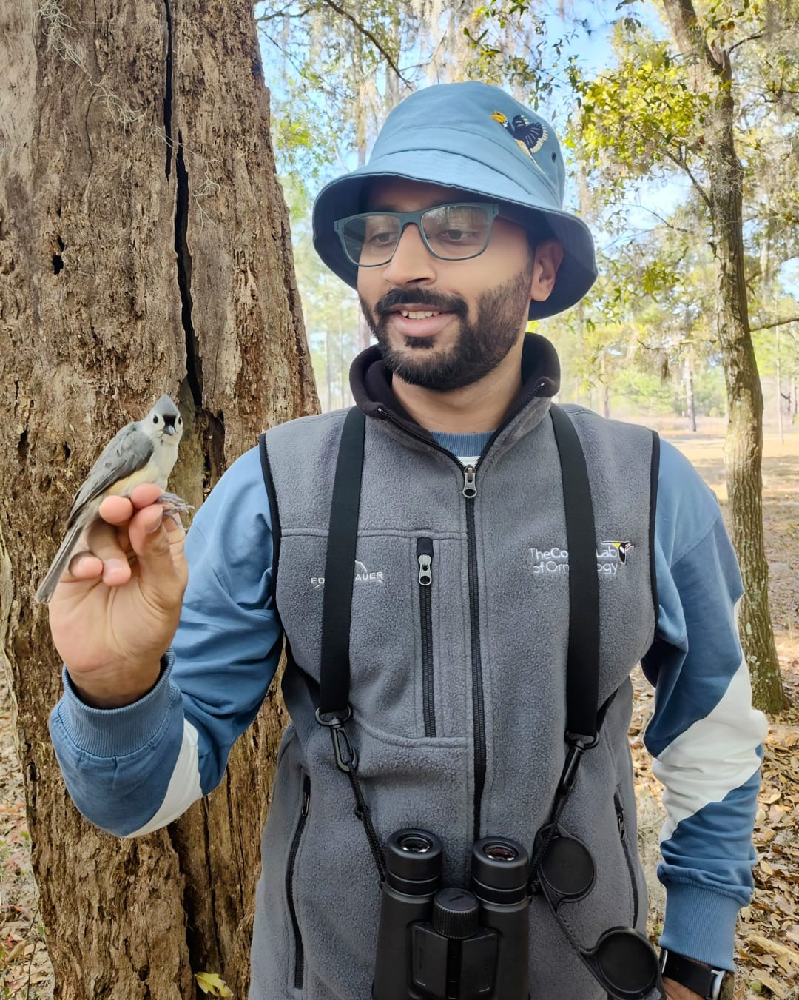

```{=html}
<style>
.home-row {
  display: flex;
  flex-wrap: wrap;
  align-items: center;
  margin-top: 2rem;
}

.home-text {
  flex: 1 1 60%;
  padding-right: 1.5rem;
  font-size: 1.1rem;
}

.home-img {
  flex: 1 1 40%;
  text-align: center;
}

.home-img img {
  max-width: 100%;
  border-radius: 10px;
  box-shadow: 0 2px 8px rgba(0,0,0,0.15);
}
</style>
```

---
title: "Suyash Sawant"
subtitle: "Avian Communication • Acoustic Monitoring • Mixed-Species Flocks • Vocal Complexity"
format: html
---

::::: home-row
::: home-text
# Welcome

I am a PhD Candidate in the [Department of Wildlife Ecology and Conservation (WEC)](https://wec.ifas.ufl.edu/) and the [School of Natural Resources and Environment (SNRE)](https://snre.ifas.ufl.edu/) at the University of Florida. I am working in the [Sieving Lab](https://wec.ifas.ufl.edu/people/wec-faculty/kathryn-sieving/), studying the information landscapes of mixed-species flocks.

This website hosts my:

-   **Research**
-   **Publications**
-   **Datasets**
-   **Media**
:::

::: home-img

:::
:::::

```{=html}
<style>
.contact-row {
  display: flex;
  flex-wrap: wrap;
  align-items: flex-start;
  margin-top: 1.5rem;
}

/* left = contact, right = icons */
.contact-left {
  flex: 1 1 50%;
  padding-right: 1.5rem;
}

.contact-right {
  flex: 1 1 50%;
}

/* 2×2 icon grid */
.icon-grid {
  display: grid;
  grid-template-columns: repeat(2, auto);
  gap: 0.75rem 1.5rem;
}

.icon-grid a img {
  width: 32px;
  height: 32px;
}
</style>
```

:::::: contact-row
::: contact-left
### Contact

📧 **Email:** [s.sawant\@ufl.edu](mailto:s.sawant@ufl.edu)

📍 **Address:\
**301-A, Newin-Zeigler Hall,**\
**University of Florida, WEC Department\
Gainesville, FL 32611, USA
:::

:::: contact-right
### Profiles

::: icon-grid
<a href="https://scholar.google.com/citations?user=bVVhIbEAAAAJ&hl=en&oi=ao" target="_blank">  </a>

<a href="https://www.researchgate.net/profile/Suyash-Sawant" target="_blank">  </a>

<a href="https://github.com/suyash-sawant" target="_blank">  </a>

<a href="https://www.instagram.com/suyash_naevia" target="_blank">  </a>
:::
::::
::::::
