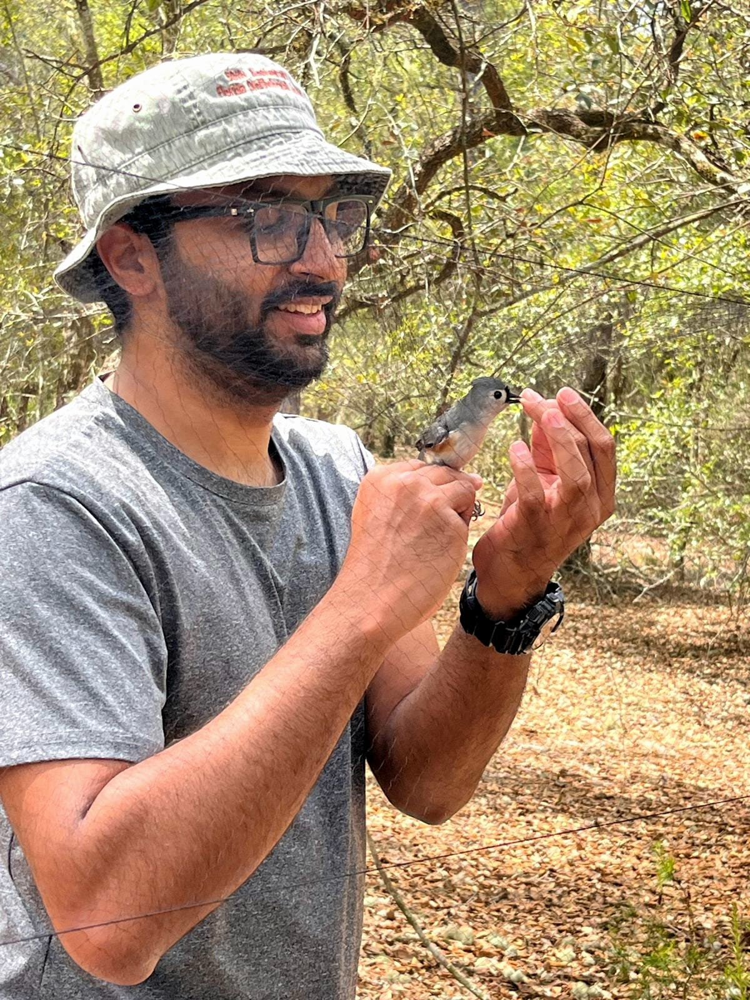

```{=html}
<style>

/* Remove Quarto heading anchor/link icons */
a.anchorjs-link {
  display: none !important;
}

/* =========================================================
   HOMEPAGE — GENERAL
========================================================= */

.home-page {
  width: 100vw;
  margin-left: calc(50% - 50vw);
  margin-right: calc(50% - 50vw);
  color: #1d1d1d;
}

.home-container {
  width: 92vw;
  max-width: 1600px;
  margin: 0 auto;
}

.home-section {
  padding: 4.5rem 0;
}

.home-section-title {
  color: #5a6f5e;
  font-size: clamp(1.8rem, 2.5vw, 2.6rem);
  font-weight: 700;
  margin: 0 0 1.2rem 0;
}

.home-section-intro {
  max-width: 900px;
  font-size: 1.08rem;
  line-height: 1.7;
  margin-bottom: 2.5rem;
}


/* Hide Quarto's default title block */
#title-block-header {
  display: none;
}


/* =========================================================
   HERO
========================================================= */

.home-hero {
  background: #f3f0e6;
  padding: 4rem 0 5rem 0;
}

.hero-grid {
  display: grid;
  grid-template-columns: minmax(0, 3fr) minmax(320px, 2fr);
  gap: clamp(3rem, 6vw, 7rem);
  align-items: center;
}

.hero-name {
  color: #5a6f5e;
  font-size: clamp(3rem, 5vw, 5.3rem);
  font-weight: 700;
  line-height: 1;
  margin: 0 0 1rem 0;
}

.hero-role {
  color: #687269;
  font-size: clamp(1.05rem, 1.5vw, 1.35rem);
  font-weight: 600;
  letter-spacing: 0.03em;
  margin-bottom: 2rem;
}

.hero-tagline {
  color: #263328;
  font-size: clamp(1.8rem, 3vw, 3.2rem);
  line-height: 1.12;
  font-weight: 650;
  max-width: 850px;
  margin: 0 0 1.6rem 0;
}

.hero-description {
  max-width: 800px;
  font-size: 1.12rem;
  line-height: 1.75;
  margin-bottom: 2rem;
}

.hero-affiliation {
  max-width: 800px;
  font-size: 0.98rem;
  line-height: 1.65;
  color: #555;
  margin-bottom: 2rem;
}

.hero-affiliation a {
  color: #5a6f5e;
}

.hero-buttons {
  display: flex;
  flex-wrap: wrap;
  gap: 0.8rem;
}

.hero-button {
  display: inline-block;
  padding: 0.7rem 1.25rem;
  border: 2px solid #5a6f5e;
  border-radius: 4px;
  color: #5a6f5e !important;
  font-weight: 650;
  text-decoration: none;
  transition: all 0.2s ease;
}

.hero-button.primary {
  background: #5a6f5e;
  color: white !important;
}

.hero-button:hover {
  background: #5a6f5e;
  color: white !important;
  text-decoration: none;
}

.hero-image {
  display: flex;
  justify-content: center;
  align-items: center;
}

.hero-image img {
  width: 100%;
  max-width: 520px;
  display: block;
  border-radius: 8px;
  box-shadow: 0 3px 12px rgba(0,0,0,0.13);
}


/* =========================================================
   AVIAN INFORMATION LANDSCAPES
========================================================= */

.information-section {
  background: #edf0ea;
}

.information-content {
  max-width: 1200px;
}

.information-statement {
  font-size: clamp(1.25rem, 1.8vw, 1.65rem);
  line-height: 1.65;
  color: #344236;
  max-width: 1100px;
  margin-bottom: 2.8rem;
}

.info-flow {
  display: grid;
  grid-template-columns:
    1fr auto 1fr auto 1fr auto 1fr auto 1fr;
  align-items: center;
  gap: 1rem;
  max-width: 1200px;
}

.info-step {
  background: white;
  padding: 1.2rem 0.8rem;
  text-align: center;
  font-weight: 650;
  color: #5a6f5e;
  border-radius: 5px;
}

.info-arrow {
  color: #5a6f5e;
  font-size: 1.5rem;
  font-weight: 700;
}


/* =========================================================
   RESEARCH THEMES
========================================================= */

.themes-section {
  background: #f3f0e6;
}

.theme-grid {
  display: grid;
  grid-template-columns: repeat(3, minmax(0, 1fr));
  gap: 2.5rem;
}

.theme-card {
  border-top: 4px solid #5a6f5e;
  padding-top: 1.3rem;
}

.theme-card h3 {
  color: #5a6f5e;
  font-size: 1.35rem;
  margin: 0 0 0.8rem 0;
}

.theme-card p {
  line-height: 1.65;
  margin: 0;
}


/* =========================================================
   CURRENT RESEARCH
========================================================= */

.current-section {
  background: white;
}

.current-grid {
  display: grid;
  grid-template-columns: repeat(3, minmax(0, 1fr));
  gap: 2.5rem;
}

.current-card {
  background: #f3f0e6;
  padding: 1.7rem;
  border-radius: 5px;
}

.current-card h3 {
  color: #5a6f5e;
  font-size: 1.25rem;
  line-height: 1.3;
  margin: 0 0 0.8rem 0;
}

.current-card p {
  line-height: 1.65;
  margin-bottom: 1rem;
}

.current-card a {
  color: #5a6f5e;
  font-weight: 650;
  text-decoration: none;
}

.current-card a:hover {
  text-decoration: underline;
}


/* =========================================================
   LATEST RESEARCH
========================================================= */

.latest-section {
  background: #edf0ea;
}

.latest-grid {
  display: grid;
  grid-template-columns: repeat(2, minmax(0, 1fr));
  gap: 2rem;
}

.latest-item {
  background: white;
  border-left: 5px solid #5a6f5e;
  padding: 1.5rem 1.7rem;
}

.latest-status {
  color: #687269;
  font-size: 0.88rem;
  font-weight: 700;
  text-transform: uppercase;
  letter-spacing: 0.08em;
  margin-bottom: 0.5rem;
}

.latest-item h3 {
  color: #263328;
  font-size: 1.1rem;
  line-height: 1.45;
  margin: 0 0 0.8rem 0;
}

.latest-item p {
  margin: 0;
  font-size: 0.95rem;
}

.latest-item a {
  color: #5a6f5e;
  font-weight: 650;
}

.section-link {
  margin-top: 1.7rem;
}

.section-link a {
  color: #5a6f5e;
  font-weight: 700;
  text-decoration: none;
}

.section-link a:hover {
  text-decoration: underline;
}


/* =========================================================
   MEDIA TEASER
========================================================= */

.media-section {
  background: #f3f0e6;
}

.media-preview {
  display: grid;
  grid-template-columns: repeat(4, minmax(0, 1fr));
  gap: 1rem;
}

.media-preview a {
  display: block;
  overflow: hidden;
  border-radius: 5px;
}

.media-preview img {
  width: 100%;
  aspect-ratio: 4 / 3;
  object-fit: cover;
  display: block;
  transition: transform 0.25s ease;
}

.media-preview a:hover img {
  transform: scale(1.025);
}


/* =========================================================
   CONTACT / FOOTER
========================================================= */

.contact-section {
  background: #5a6f5e;
  color: white;
}

.contact-section .home-section-title {
  color: white;
}

.contact-grid {
  display: grid;
  grid-template-columns: minmax(0, 2fr) minmax(260px, 1fr);
  gap: 4rem;
  align-items: start;
}

.contact-text {
  font-size: 1.05rem;
  line-height: 1.7;
}

.contact-text a {
  color: white;
  font-weight: 650;
}

.profile-links {
  display: flex;
  flex-wrap: wrap;
  gap: 1.3rem;
  align-items: center;
}

.profile-links a {
  width: 38px;
  height: 38px;
  background: white;
  border-radius: 50%;
  display: flex;
  align-items: center;
  justify-content: center;
  transition: transform 0.2s ease;
}

.profile-links a:hover {
  transform: translateY(-2px);
}

.profile-links img {
  width: 21px;
  height: 21px;
}


/* =========================================================
   RESPONSIVE
========================================================= */

@media (max-width: 1000px) {

  .hero-grid {
    grid-template-columns: 1fr 0.65fr;
    gap: 2.5rem;
  }

  .theme-grid,
  .current-grid {
    gap: 1.5rem;
  }

  .info-flow {
    grid-template-columns: 1fr;
    max-width: 650px;
  }

  .info-arrow {
    transform: rotate(90deg);
    text-align: center;
  }

}


@media (max-width: 750px) {

  .home-section {
    padding: 3rem 0;
  }

  .home-container {
    width: calc(100% - 3rem);
  }

  .home-hero {
    padding: 2.5rem 0 3.5rem 0;
  }

  .hero-grid {
    grid-template-columns: 1fr;
  }

  .hero-image {
    order: -1;
  }

  .hero-image img {
    max-width: 380px;
  }

  .hero-name {
    font-size: 2.8rem;
  }

  .theme-grid,
  .current-grid,
  .latest-grid {
    grid-template-columns: 1fr;
  }

  .media-preview {
    grid-template-columns: repeat(2, 1fr);
  }

  .contact-grid {
    grid-template-columns: 1fr;
    gap: 2rem;
  }

}

</style>
```

```{=html}
<div class="home-page">


<!-- =========================================================
     HERO
========================================================= -->

<section class="home-hero">

  <div class="home-container">

    <div class="hero-grid">

      <div class="hero-content">

        <h1 class="hero-name">Suyash Sawant</h1>

        <div class="hero-role">
          Behavioral Ecologist &nbsp;•&nbsp; Bioacoustician &nbsp;•&nbsp; Quantitative Ecologist
        </div>

        <div class="hero-tagline">
          Understanding how information moves through animal communities.
        </div>

        <p class="hero-description">
          I study vocal communication, social information, and mixed-species bird communities, integrating field ecology, bioacoustics, passive acoustic monitoring, and quantitative modeling.
        </p>

        <p class="hero-affiliation">
          I am a PhD Candidate in the
          <a href="https://wec.ifas.ufl.edu/" target="_blank">Department of Wildlife Ecology and Conservation</a>
          and the
          <a href="https://snre.ifas.ufl.edu/" target="_blank">School of Natural Resources and Environment</a>
          at the University of Florida. Currently, I work in the
          <a href="https://wec.ifas.ufl.edu/people/wec-faculty/kathryn-sieving/" target="_blank">Sieving Lab</a> with Dr. Kathryn E. Sieving.
        </p>

        <div class="hero-buttons">

          <a class="hero-button primary" href="research.html">
            Explore Research
          </a>

          <a class="hero-button" href="publications.html">
            Publications
          </a>

        </div>

      </div>


      <div class="hero-image">

        

      </div>

    </div>

  </div>

</section>


<!-- =========================================================
     AVIAN INFORMATION LANDSCAPES
========================================================= -->

<section class="home-section information-section">

  <div class="home-container">

    <div class="information-content">

      <h2 class="home-section-title">
        Avian Information Landscapes
      </h2>

      <p class="information-statement">
        Animals live in landscapes of information. My research asks how birds produce, transmit, receive, and use social information and how environmental and social change reshape these communication networks.
      </p>


      <div class="info-flow">

        <div class="info-step">
          Sender's Motivation
        </div>

        <div class="info-arrow">→</div>

        <div class="info-step">
          Signal Production
        </div>

        <div class="info-arrow">→</div>

        <div class="info-step">
          Signal Propagation
        </div>

        <div class="info-arrow">→</div>

        <div class="info-step">
          Signal Reception
        </div>

        <div class="info-arrow">→</div>

        <div class="info-step">
          Receiver's Response
        </div>

      </div>

    </div>

  </div>

</section>


<!-- =========================================================
     CURRENT RESEARCH
========================================================= -->

<section class="home-section current-section">

  <div class="home-container">

    <h2 class="home-section-title">
      Current Research
    </h2>

    <p class="home-section-intro">
      My current work connects mechanisms of vocal communication with the structure and dynamics of avian social communities.
    </p>


    <div class="current-grid">


      <div class="current-card">

        <h3>
          Mixed-Species Flock Dynamics
        </h3>

        <p>
          Understanding how anthropogenic disturbance changes flock composition, leadership, social cohesion, and information flow.
        </p>

        <a href="research.html">
          Explore research →
        </a>

      </div>


      <div class="current-card">

        <h3>
          Functional Communication Ranges
        </h3>

        <p>
          Connecting signal production, environmental propagation, and receiver biology to understand when vocal signals remain functionally available.
        </p>

        <a href="research.html">
          Explore research →
        </a>

      </div>


      <div class="current-card">

        <h3>
          Vocal Complexity & Cultural Evolution
        </h3>

        <p>
          Investigating how complex vocal repertoires are structured, shared, retained, and culturally transmitted within and among individuals.
        </p>

        <a href="research.html">
          Explore research →
        </a>

      </div>


    </div>

  </div>

</section>


<!-- =========================================================
     LATEST RESEARCH
========================================================= -->

<section class="home-section latest-section">

  <div class="home-container">

    <h2 class="home-section-title">
      Latest Research
    </h2>


    <div class="latest-grid">


      <div class="latest-item">

        <div class="latest-status">
          bioRxiv · 2025
        </div>

        <h3>
          Distinct, asynchronous processes underlie cultural and genetic variation in a bird species with complex song repertoires.
        </h3>

        <p>
          <a
            href="https://doi.org/10.1101/2025.11.02.684965"
            target="_blank">
            Read preprint →
          </a>
        </p>

      </div>


      <div class="latest-item">

        <div class="latest-status">
          Under Review
        </div>

        <h3>
          Reuse, retention, and sharing of song sequences in the complex songs of a tropical passerine.
        </h3>

        <p>
          Under review at <em>The American Naturalist</em>.
        </p>

      </div>


    </div>


    <div class="section-link">

      <a href="publications.html">
        View all publications →
      </a>

    </div>

  </div>

</section>


<!-- =========================================================
     MEDIA
========================================================= -->

<section class="home-section media-section">

  <div class="home-container">

    <h2 class="home-section-title">
      From the Field & Beyond
    </h2>

    <p class="home-section-intro">
      Fieldwork, teaching, conferences, and the people and places behind the research.
    </p>


    <div class="media-preview">
      
      <a href="media.html">
        
      </a>

      <a href="media.html">
        
      </a>

      <a href="media.html">
        
      </a>

      <a href="media.html">
        
      </a>

    </div>


    <div class="section-link">

      <a href="media.html">
        Explore Media →
      </a>

    </div>

  </div>

</section>


<!-- =========================================================
     CONTACT
========================================================= -->

<section class="home-section contact-section">

  <div class="home-container">

    <div class="contact-grid">


      <div>

        <h2 class="home-section-title">
          Get in Touch
        </h2>

        <div class="contact-text">

          <p>
            Department of Wildlife Ecology and Conservation<br>
            University of Florida · Gainesville, Florida
          </p>

          <p>
            <strong>Email:</strong>
            <a href="mailto:s.sawant@ufl.edu">
              s.sawant@ufl.edu
            </a>
          </p>

        </div>

      </div>


      <div>

        <h2 class="home-section-title">
          Profiles
        </h2>

        <div class="profile-links">


          <a
            href="https://scholar.google.com/citations?user=bVVhIbEAAAAJ&hl=en&oi=ao"
            target="_blank"
            title="Google Scholar">

            

          </a>


          <a
            href="https://www.researchgate.net/profile/Suyash-Sawant"
            target="_blank"
            title="ResearchGate">

            

          </a>


          <a
            href="https://github.com/suyash-sawant"
            target="_blank"
            title="GitHub">

            

          </a>


          <a
            href="https://www.instagram.com/suyash_naevia"
            target="_blank"
            title="Instagram">

            

          </a>


        </div>

      </div>


    </div>

  </div>

</section>


</div>
```
