```{=html}
<style>

/* =========================================================
   MEDIA PAGE
   ========================================================= */

.media-intro {
  max-width: 850px;
  margin: 0 auto 2.5rem auto;
  text-align: center;
  font-size: 1.05rem;
  line-height: 1.6;
}


/* YEAR HEADINGS */

.media-year {
  margin-top: 3.2rem;
  margin-bottom: 1.1rem;
  padding-bottom: 0.35rem;
  border-bottom: 1px solid rgba(128, 128, 128, 0.35);
  font-size: 1.8rem;
  font-weight: 600;
}


/* =========================================================
   GALLERY GRID
   ========================================================= */

.gallery {
  display: grid;
  grid-template-columns: repeat(4, minmax(0, 1fr));
  gap: 12px;
  margin-bottom: 2rem;
}


/* =========================================================
   INDIVIDUAL IMAGE CARD
   ========================================================= */

.gallery-item {
  position: relative;
  overflow: hidden;
  border-radius: 7px;
  background: #111;
  aspect-ratio: 4 / 3;
  cursor: default;
}


/* IMAGE */

.gallery-item img {
  width: 100%;
  height: 100%;
  display: block;
  object-fit: cover;

  /* Smooth hover effect */
  transition:
    transform 0.35s ease,
    filter 0.35s ease;
}


/* Slight zoom when hovering */

.gallery-item:hover img {
  transform: scale(1.04);
  filter: brightness(0.45);
}


/* =========================================================
   CAPTION OVERLAY
   ========================================================= */

.gallery-caption {
  position: absolute;
  inset: 0;

  display: flex;
  flex-direction: column;
  justify-content: flex-end;

  padding: 1rem;

  color: white;

  background:
    linear-gradient(
      to top,
      rgba(0, 0, 0, 0.90) 0%,
      rgba(0, 0, 0, 0.65) 45%,
      rgba(0, 0, 0, 0.15) 100%
    );

  opacity: 0;
  transition: opacity 0.3s ease;
}


/* Show caption on hover */

.gallery-item:hover .gallery-caption {
  opacity: 1;
}


/* Caption heading */

.gallery-caption h3 {
  color: white;
  margin: 0 0 0.35rem 0;
  font-size: 1.05rem;
  line-height: 1.2;
  font-weight: 650;
}


/* Caption text */

.gallery-caption p {
  color: rgba(255, 255, 255, 0.94);
  margin: 0;
  font-size: 0.82rem;
  line-height: 1.35;
}


/* Photo credit */

.gallery-caption .credit {
  margin-top: 0.4rem;
  font-size: 0.72rem;
  font-style: italic;
  color: rgba(255, 255, 255, 0.72);
}


/* =========================================================
   RESPONSIVE LAYOUT
   ========================================================= */

/* Smaller laptops */
@media (max-width: 1200px) {
  .gallery {
    grid-template-columns: repeat(3, minmax(0, 1fr));
  }
}


/* Tablets */
@media (max-width: 800px) {
  .gallery {
    grid-template-columns: repeat(2, minmax(0, 1fr));
  }
}


/* Phones */
@media (max-width: 520px) {

  .gallery {
    grid-template-columns: 1fr;
  }

  /*
    Phones do not have hover, so captions remain visible.
  */

  .gallery-caption {
    opacity: 1;
    background:
      linear-gradient(
        to top,
        rgba(0, 0, 0, 0.88) 0%,
        rgba(0, 0, 0, 0.45) 55%,
        transparent 100%
      );
  }

}

/* =========================================================
   MAKE MEDIA PAGE WIDER
   ========================================================= */

/* Override Quarto's normal constrained content width */
#quarto-content,
main.content {
  max-width: none !important;
}

/* Main media content width */
main.content {
  width: 92vw !important;
  margin-left: calc(50% - 46vw) !important;
  margin-right: calc(50% - 46vw) !important;
}

/* Keep introductory text readable */
.media-intro {
  max-width: 850px;
  margin: 0 auto 2.5rem auto;
  text-align: center;
  font-size: 1.05rem;
  line-height: 1.6;
}

</style>
```

```{=html}
<!-- ======================================================
     2026
     ====================================================== -->
```

<h2 class="media-year">

2026

</h2>

::::::::::::: gallery
::::: gallery-item
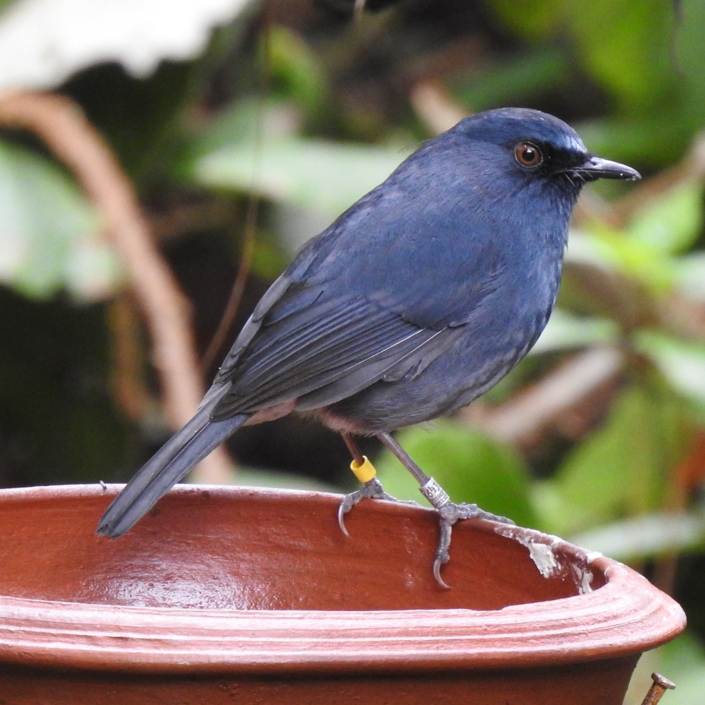{alt="SeCAB 2026"}

:::: gallery-caption
<h3>SeCAB, Knoxville — September 2026</h3>

<p>Talking about social communication in mixed-species bird flocks at the 2026 Southeastern Conference for Animal Behavior (SeCAB) at the University of Tennessee, Knoxville.</p>

::: credit
Photo: Sidd Satishchandran
:::
::::
:::::

:::: gallery-item
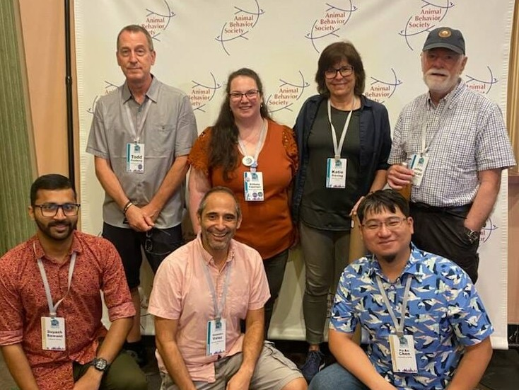{alt="Animal Behavior Society 2026"}

::: gallery-caption
<h3>Animal Behavior Society, Cincinnati — August 2026</h3>

<p>With Dr. Todd Freeberg, Dr. Brittanny Coppinger, Dr. Katie Sieving, Dr. Jeff Lucas, Dr. Alejandro Vélez Meléndez, and Po-an Chen at the 2026 Animal Behavior Society meeting in Cincinnati, Ohio.</p>
:::
::::

:::: gallery-item
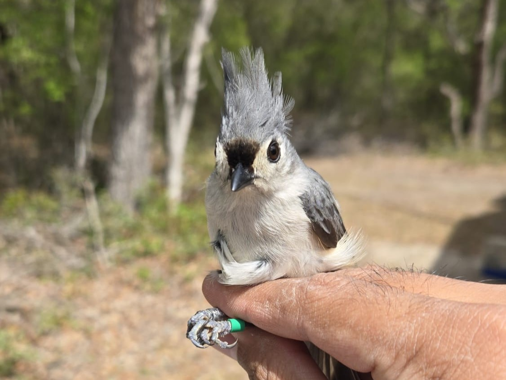{alt="Color-banded Tufted Titmouse"}

::: gallery-caption
<h3>Ordway-Swisher Biological Station — March 2026</h3>

<p>A recently banded Tufted Titmouse (<em>Baeolophus bicolor</em>) looking thoroughly unimpressed with its new green color band at Ordway-Swisher Biological Station.</p>
:::
::::

::::: gallery-item
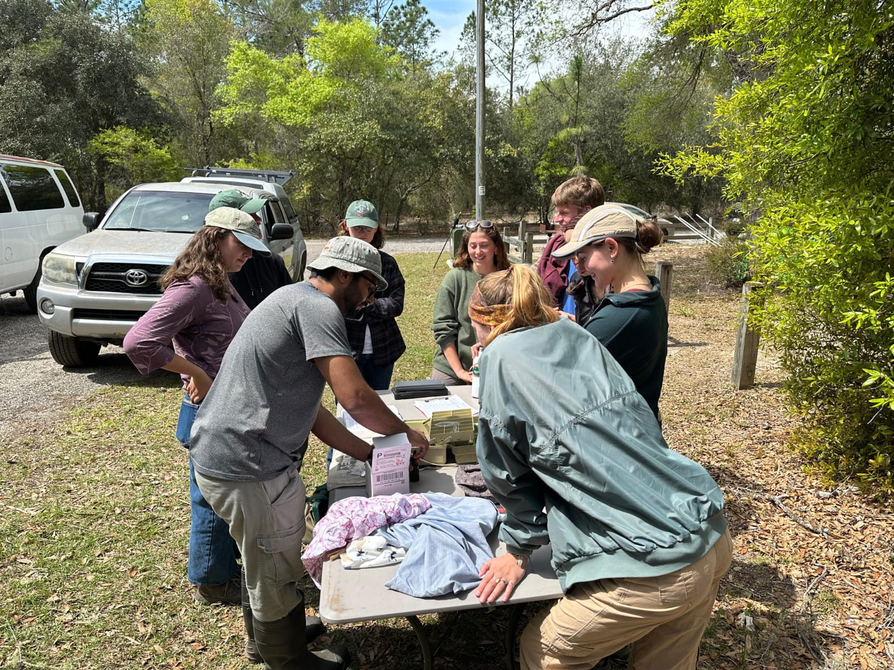{alt="Avian Field Techniques class"}

:::: gallery-caption
<h3>Ordway-Swisher Biological Station — March 2026</h3>

<p>Demonstrating mist-netting and bird-handling techniques for UF undergraduate students during Dr. Katie Sieving's Avian Field Techniques course.</p>

::: credit
Photo: Katie Sieving
:::
::::
:::::
:::::::::::::

```{=html}
<!-- ======================================================
     2025
     ====================================================== -->
```

<h2 class="media-year">

2025

</h2>

:::::::::::::::::: gallery
:::: gallery-item
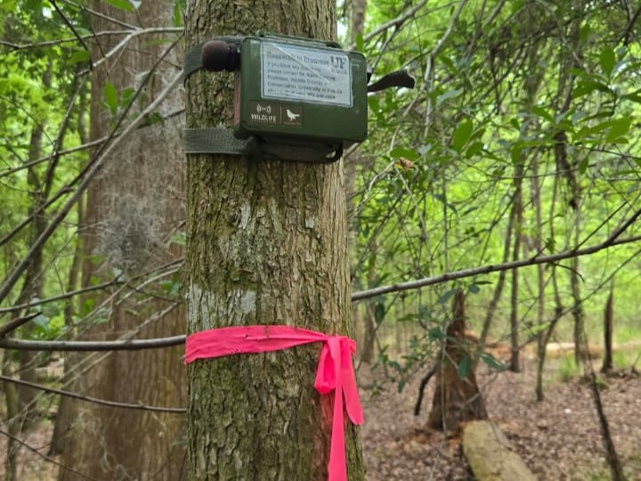{alt="Autonomous recording unit at Tall Timbers"}

::: gallery-caption
<h3>Tall Timbers Research Station — October 2025</h3>

<p>An autonomous recording unit deployed at Livingston Place to record winter mixed-species flocks as part of our long-term monitoring of flock communities across a latitudinal gradient in the southeastern United States.</p>
:::
::::

::::: gallery-item
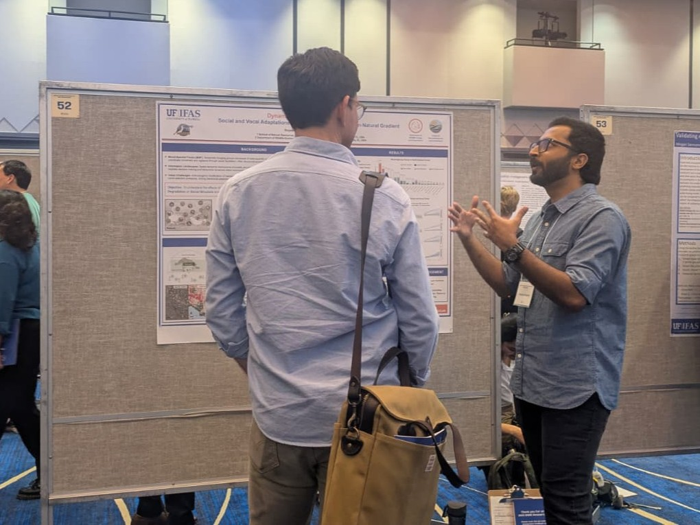{alt="SNRE Symposium 2025"}

:::: gallery-caption
<h3>SNRE Symposium — October 2025</h3>

<p>Discussing my mixed-species flock research with my committee member, Dr. Miguel Acevedo, at the 2025 UF School of Natural Resources and Environment Annual Symposium.</p>

::: credit
Photo: Yukti Taneja
:::
::::
:::::

:::: gallery-item
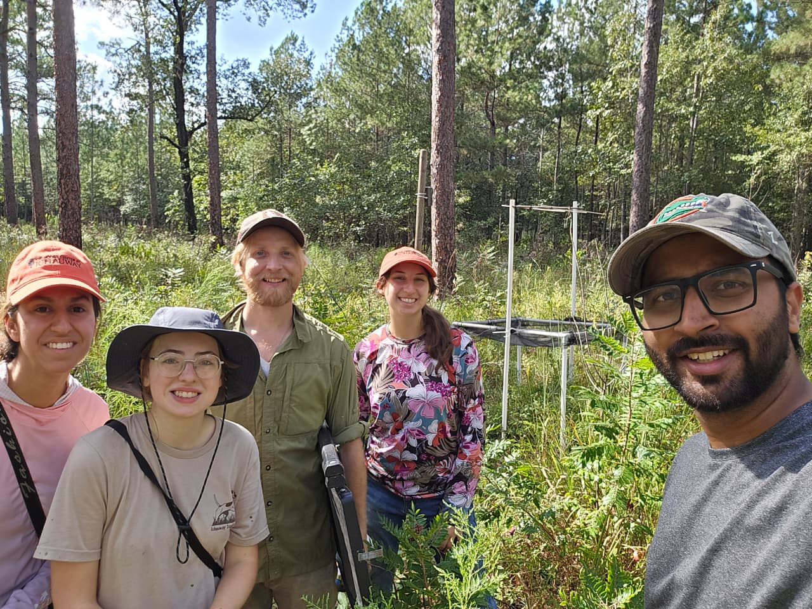{alt="ARU deployment at Jones Center"}

::: gallery-caption
<h3>Jones Center at Ichauway — September 2025</h3>

<p>Helping Dr. David Mason's lab deploy autonomous recording units at the Jones Center at Ichauway for a collaborative project investigating social dimensions of the "landscape of fear."</p>
:::
::::

::::: gallery-item
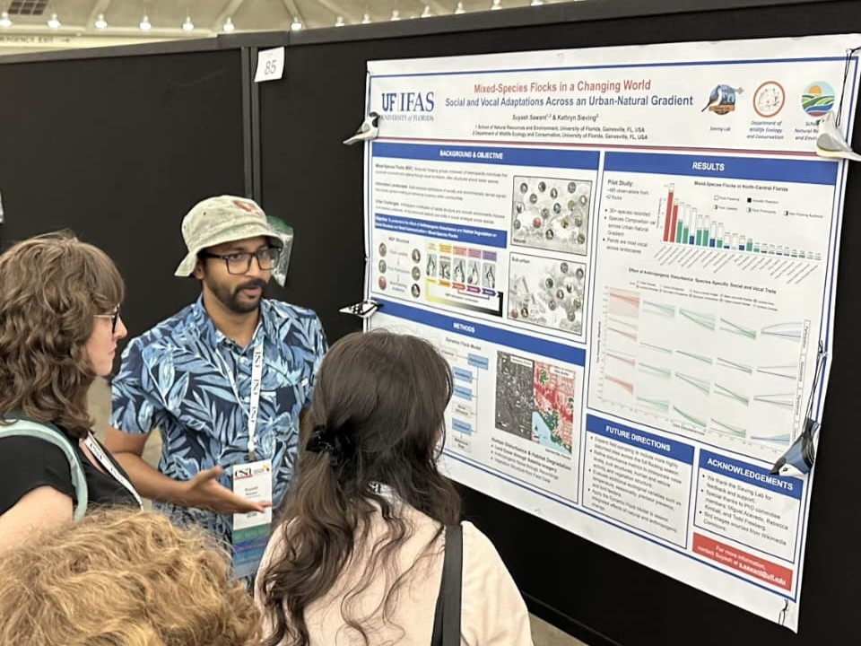{alt="ESA Annual Meeting 2025"}

:::: gallery-caption
<h3>ESA, Baltimore — August 2025</h3>

<p>Presenting preliminary results from my PhD research on mixed-species flock social dynamics across an urban-natural gradient at the Ecological Society of America Annual Meeting.</p>

::: credit
Photo: Katie Sieving
:::
::::
:::::

::::: gallery-item
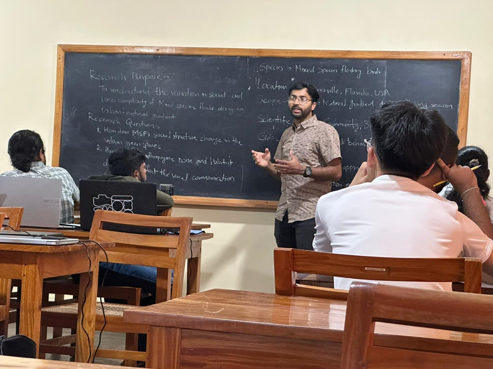{alt="Research Design for Field Biologists course"}

:::: gallery-caption
<h3>University of Peradeniya — May 2025</h3>

<p>Teaching a session on study design during the <em>Research Design for Field Biologists</em> short course at the University of Peradeniya, Sri Lanka.</p>

::: credit
Photo: Katie Sieving
:::
::::
:::::

:::: gallery-item
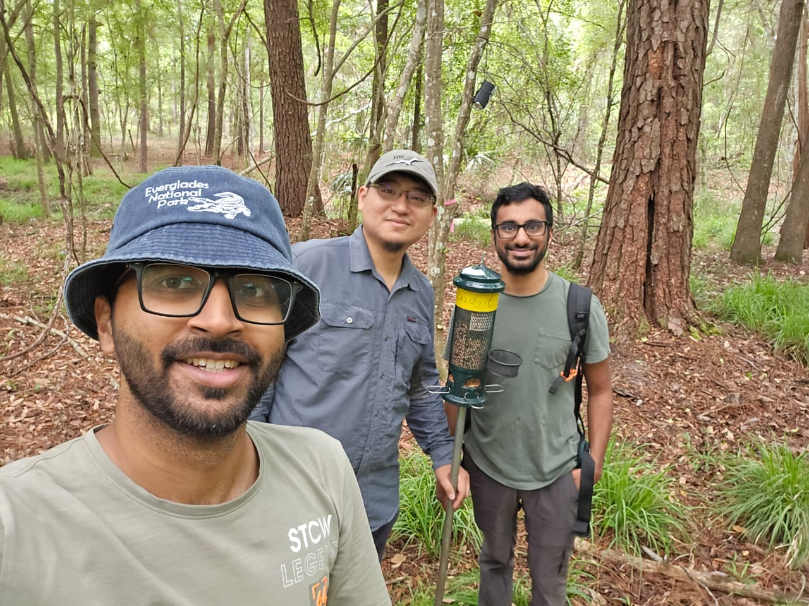{alt="Bird feeder experiment in Gainesville"}

::: gallery-caption
<h3>Gainesville — April 2025</h3>

<p>Helping Po-an Chen with field experiments investigating how bird feeders affect mixed-species flocks, alongside Sidd Satishchandran.</p>
:::
::::
::::::::::::::::::

```{=html}
<!-- ======================================================
     2024
     ====================================================== -->
```

<h2 class="media-year">

2024

</h2>

:::::::::::: gallery
::::: gallery-item
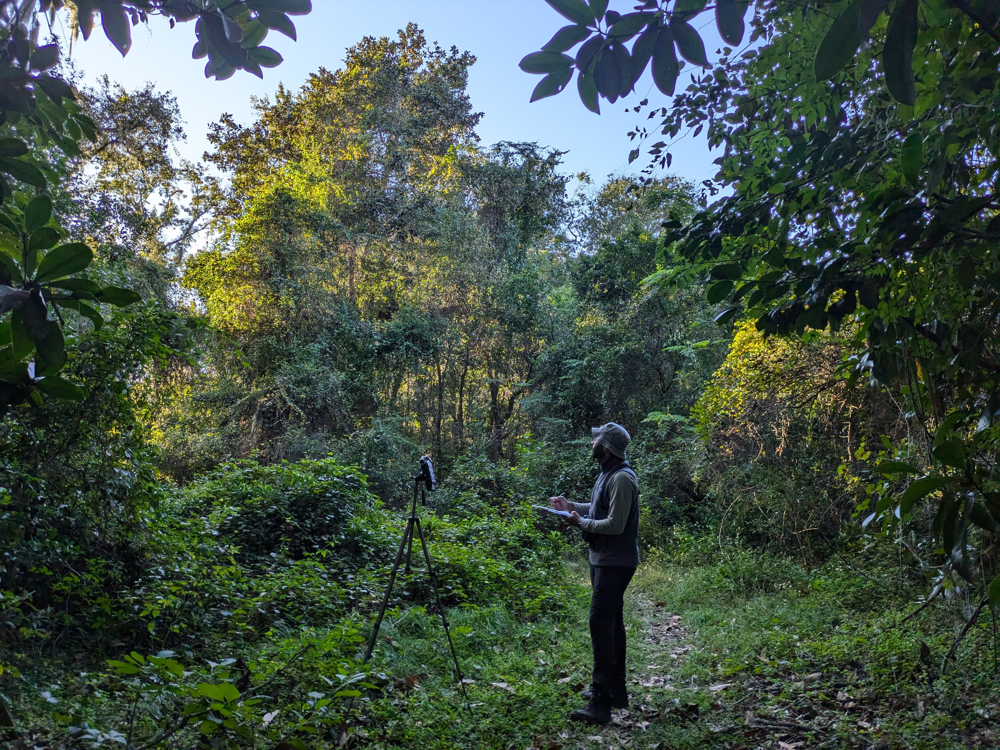{alt="Mixed-species flock fieldwork"}

:::: gallery-caption
<h3>Bivens Arm Nature Park — November 2024</h3>

<p>Collecting field data on mixed-species bird flocks at Bivens Arm Nature Park in Gainesville as part of my urban-natural gradient study.</p>

::: credit
Photo: Yukti Taneja
:::
::::
:::::

::::: gallery-item
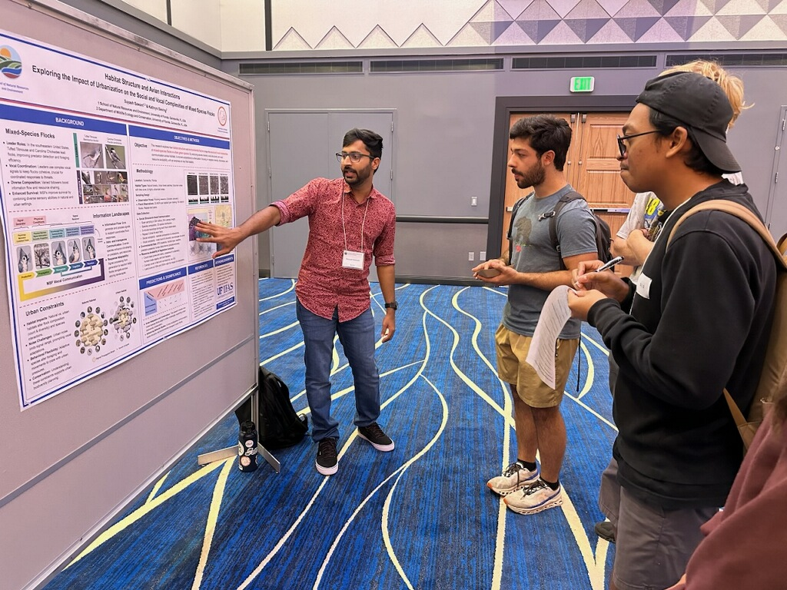{alt="SNRE Symposium 2024"}

:::: gallery-caption
<h3>SNRE Symposium — November 2024</h3>

<p>Presenting my PhD research plan on the social dynamics and vocal communication of mixed-species bird flocks at the 2024 UF School of Natural Resources and Environment Annual Symposium.</p>

::: credit
Photo: Katie Sieving
:::
::::
:::::

::::: gallery-item
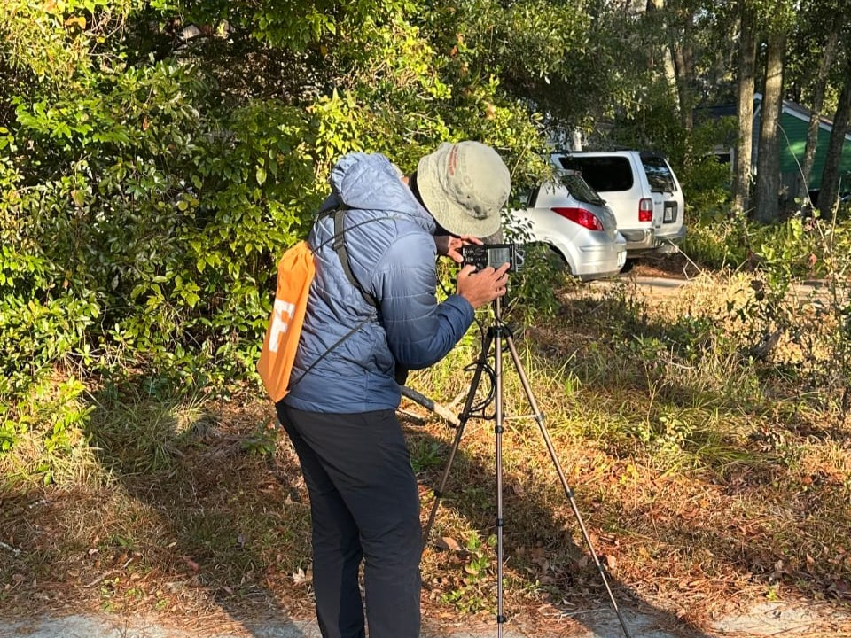{alt="Mixed-species flock field sampling"}

:::: gallery-caption
<h3>Gainesville — September 2024</h3>

<p>Working out field-sampling protocols with Dr. Katie Sieving for my PhD research on the social dynamics and vocal communication of mixed-species flocks across an urban-natural gradient.</p>

::: credit
Photo: Katie Sieving
:::
::::
:::::
::::::::::::

```{=html}
<!-- ======================================================
     2023
     ====================================================== -->
```

<h2 class="media-year">

2023

</h2>

::::::::::::::::::::: gallery
:::: gallery-item
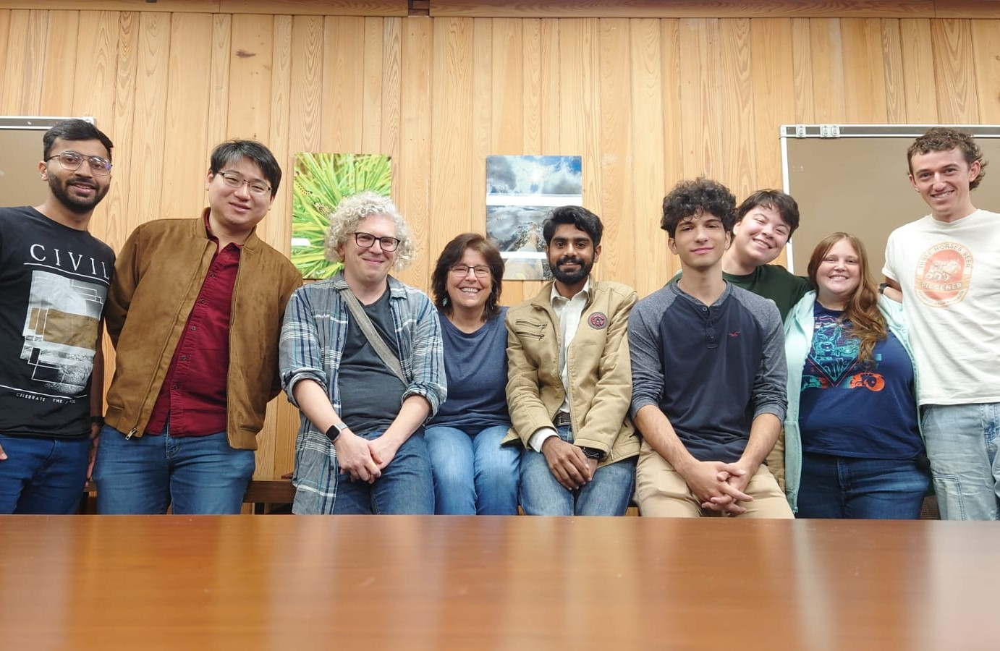{alt="Sieving Lab"}

::: gallery-caption
<h3>Sieving Lab — November 2023</h3>

<p>Wrapping up my first semester at UF with the Sieving Lab—a new lab and the beginning of my PhD fieldwork.</p>
:::
::::

::::: gallery-item
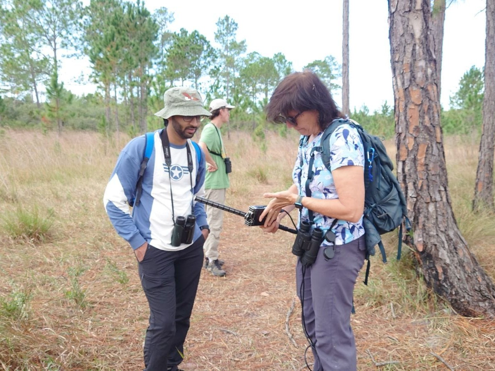{alt="Field recording in Ocala National Forest"}

:::: gallery-caption
<h3>Ocala National Forest — October 2023</h3>

<p>Figuring out field recording equipment with Dr. Katie Sieving in Ocala National Forest during my first semester at the University of Florida.</p>

::: credit
Photo: Talha Mohammad
:::
::::
:::::

::::: gallery-item
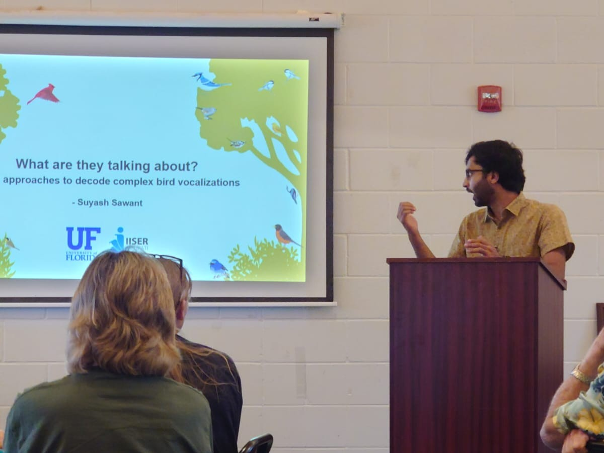{alt="Florida Ornithological Society Fall Meeting"}

:::: gallery-caption
<h3>Florida Ornithological Society — October 2023</h3>

<p>My first scientific meeting after moving to the United States for my PhD: presenting on tools for studying avian communication at the Florida Ornithological Society Fall Meeting in St. Petersburg, Florida.</p>

::: credit
Photo: Talha Mohammad
:::
::::
:::::

::::: gallery-item
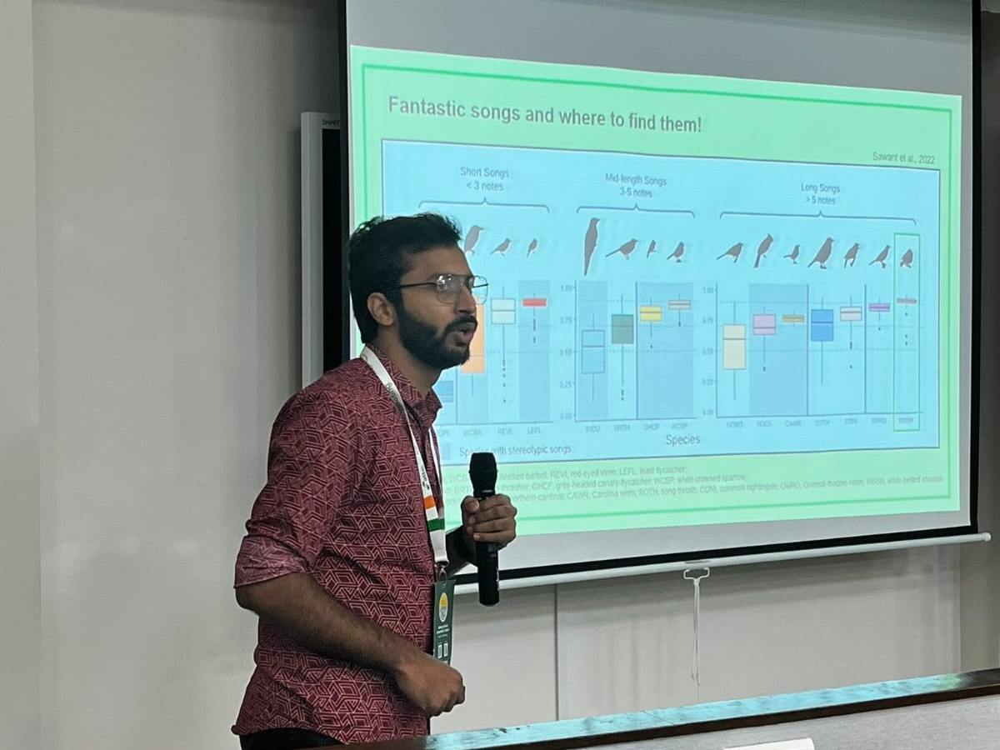{alt="ATBC 2023 presentation"}

:::: gallery-caption
<h3>ATBC, Coimbatore — June 2023</h3>

<p>Presenting three years of research on song complexity and song sharing in White-bellied Sholakilis at ATBC 2023.</p>

::: credit
Photo: Orlando Acevedo-Charry
:::
::::
:::::

:::: gallery-item
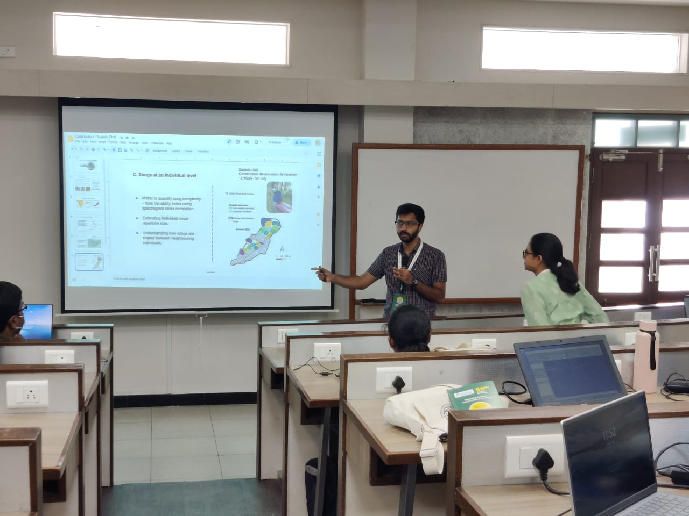{alt="ATBC bioacoustics workshop"}

::: gallery-caption
<h3>ATBC, Coimbatore — June 2023</h3>

<p>Co-teaching a session on bird bioacoustics with Chiti Arvind during a bioacoustics workshop at the Association for Tropical Biology and Conservation meeting.</p>
:::
::::

:::: gallery-item
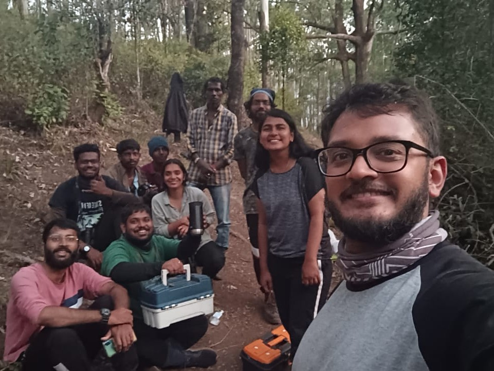{alt="Devikulam field team"}

::: gallery-caption
<h3>Devikulam — March 2023</h3>

<p>Our field team after a week of intensive bird banding and blood sampling in a shola patch near Devikulam, Kerala, as part of projects on avian malaria and cultural evolution in White-bellied Sholakilis.</p>
:::
::::

::::: gallery-item
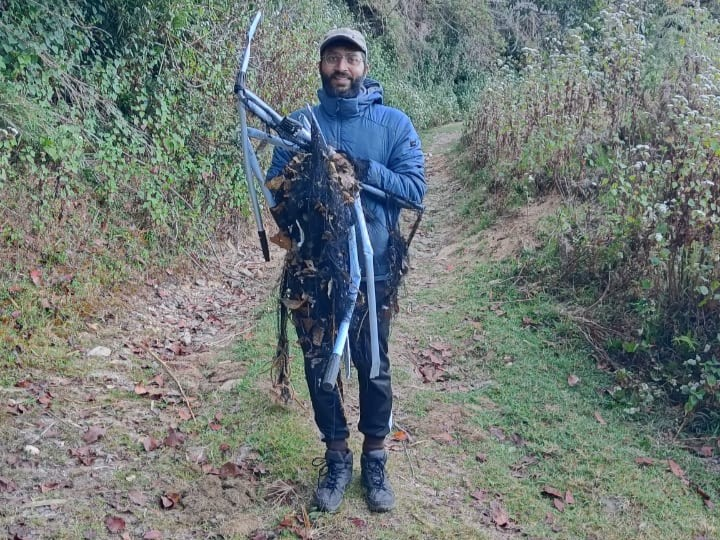{alt="Fieldwork at Pampadum Shola National Park"}

:::: gallery-caption
<h3>Pampadum Shola National Park — March 2023</h3>

<p>Carrying what remained of our mist nets and poles after a rogue elephant decided to investigate—and play with—our equipment overnight during intensive bird banding and blood sampling.</p>

::: credit
Photo: Ashwin Warudkar
:::
::::
:::::
:::::::::::::::::::::

```{=html}
<!-- ======================================================
     2022
     ====================================================== -->
```

<h2 class="media-year">

2022

</h2>

::::::::::::::::::::::::::::::: gallery
::::: gallery-item
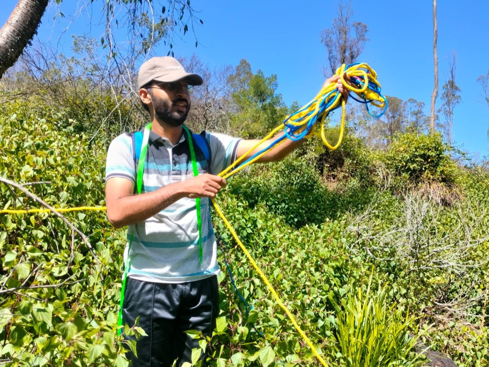{alt="Shola habitat restoration surveys"}

:::: gallery-caption
<h3>Berijam, TN — December 2022</h3>

<p>Vegetation surveys with the Tamil Nadu Forest Department, supporting efforts to remove invasive woody species and restore native shola-grassland habitats.</p>

::: credit
Photo: Aparna Rao
:::
::::
:::::

::::: gallery-item
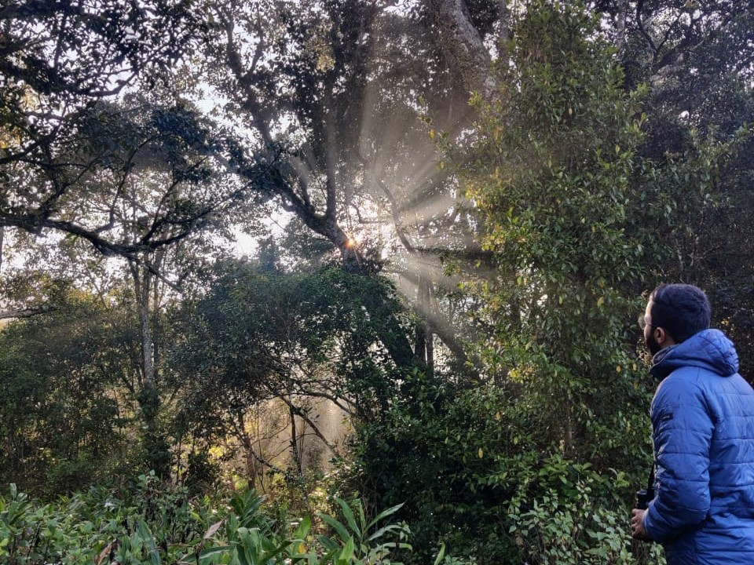{alt="Shola forest canopy"}

:::: gallery-caption
<h3>Highwavys — November 2022</h3>

<p>Sunlight filtering through the dense canopy of a shola forest near Highwavys, along the Kerala–Tamil Nadu border.</p>

::: credit
Photo: Vinay K. L.
:::
::::
:::::

::::: gallery-item
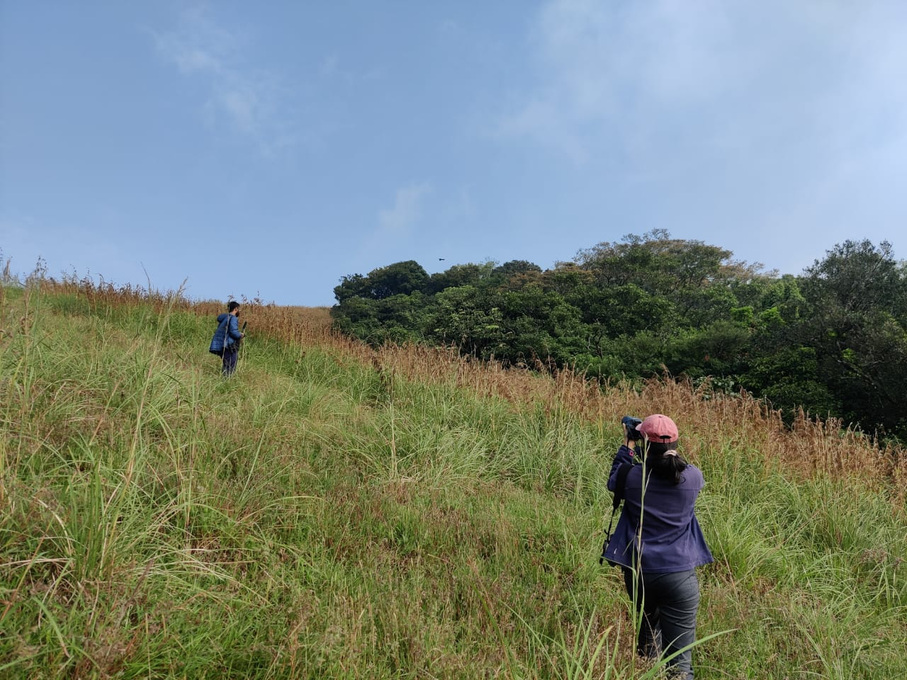{alt="Searching for White-bellied Sholakilis"}

:::: gallery-caption
<h3>Southern Western Ghats — November 2022</h3>

<p>A long journey through the shola patches of the southern Anamalai and Meghamalai Hills with Vinay K. L. and Chiti Arvind, searching for White-bellied Sholakili populations.</p>

::: credit
Photo: Vinay K. L.
:::
::::
:::::

::::: gallery-item
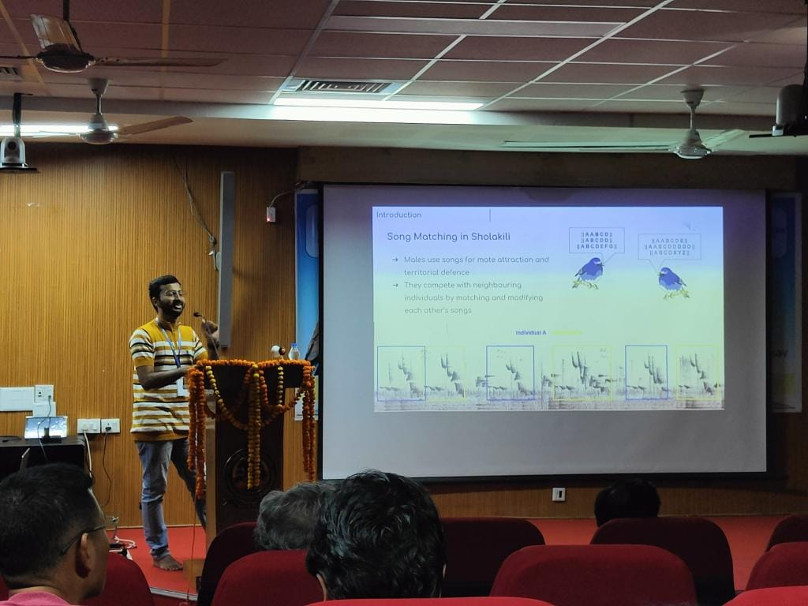{alt="NSAB 2022"}

:::: gallery-caption
<h3>NSAB, Gaya — November 2022</h3>

<p>Presenting our work on song sharing in White-bellied Sholakilis at the National Symposium on Avian Biology 2022 in Gaya, Bihar.</p>

::: credit
Photo: Chiti Arvind
:::
::::
:::::

:::: gallery-item
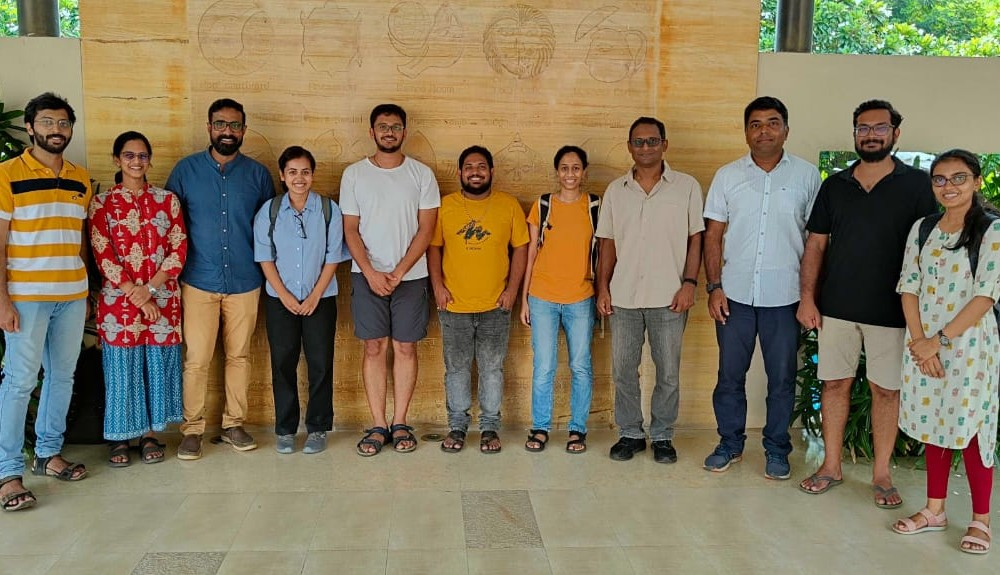{alt="IISER Tirupati Bird Lab"}

::: gallery-caption
<h3>IISER Tirupati Bird Lab — September 2022</h3>

<p>A lab outing with the IISER Tirupati Bird Lab, led by Dr. V. V. Robin—a group that shaped much of my early work in bird ecology and bioacoustics.</p>
:::
::::

::::: gallery-item
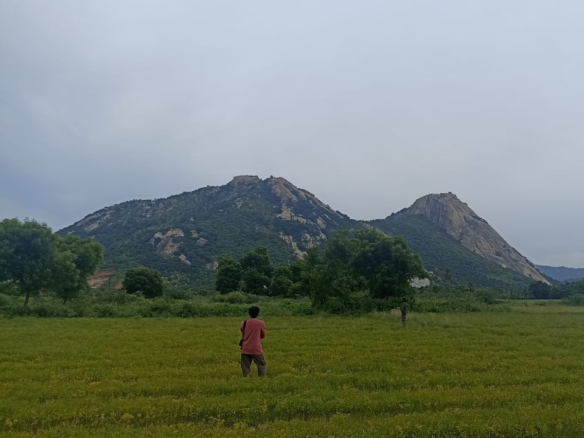{alt="Tirupati Bird Atlas"}

:::: gallery-caption
<h3>Tirupati — September 2022</h3>

<p>Exploring the landscapes around Tirupati while surveying for the first Tirupati Bird Atlas.</p>

::: credit
Photo: Raja Bandi
:::
::::
:::::

:::: gallery-item
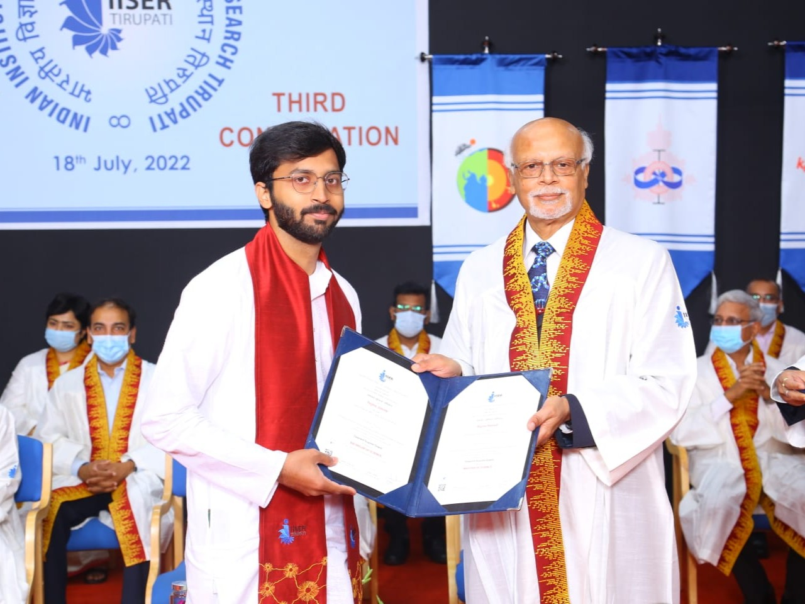{alt="IISER Tirupati convocation"}

::: gallery-caption
<h3>IISER Tirupati — July 2022</h3>

<p>Receiving my BS–MS dual degrees from Prof. K. N. Ganesh at the third convocation of IISER Tirupati.</p>
:::
::::

:::: gallery-item
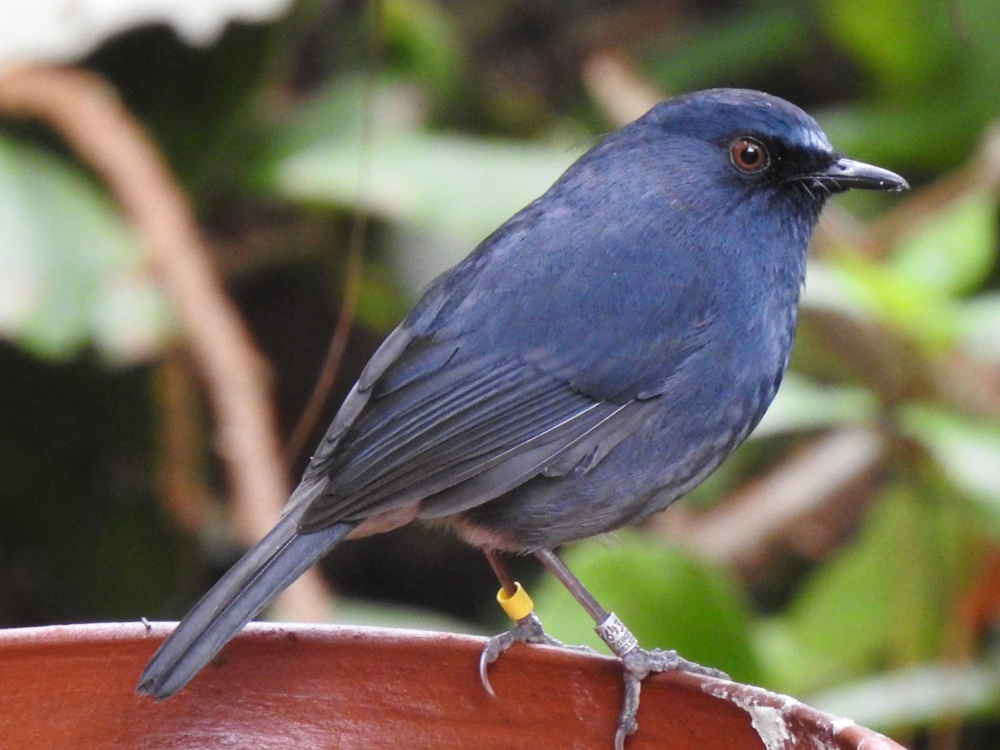{alt="Yellow, a color-banded White-bellied Sholakili"}

::: gallery-caption
<h3>Yellow — Kodaikanal, June 2022</h3>

<p>In memory of my little field buddy, <strong>Yellow (2018–2024)</strong>—a color-banded White-bellied Sholakili (<em>Sholicola albiventris</em>) who lived around our field station and became an integral part of our long-term research.</p>
:::
::::

::::: gallery-item
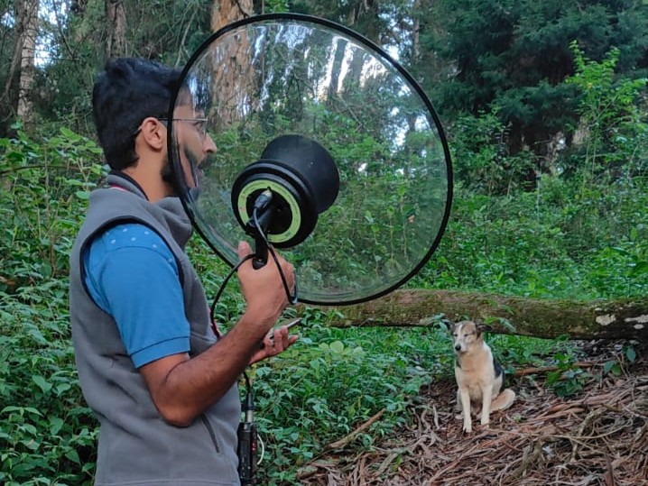{alt="Recording White-bellied Sholakilis"}

:::: gallery-caption
<h3>Kodaikanal — June 2022</h3>

<p>Recording color-banded White-bellied Sholakilis in Kodaikanal, with some field assistance from our dog, Sky.</p>

::: credit
Photo: Harikrishnan C. P.
:::
::::
:::::

:::: gallery-item
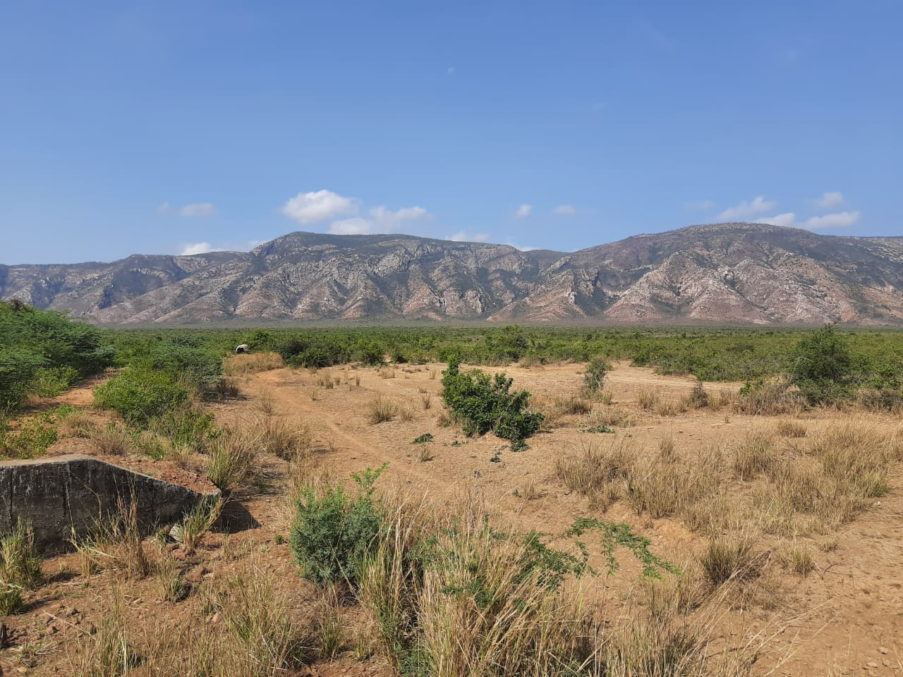{alt="Eastern Ghats scrubland"}

::: gallery-caption
<h3>Eastern Ghats — April 2022</h3>

<p>The vast open scrublands near Tirupati, Andhra Pradesh, with the Seshachalam Hills rising in the background—home to a remarkable and highly threatened bird community.</p>
:::
::::

:::: gallery-item
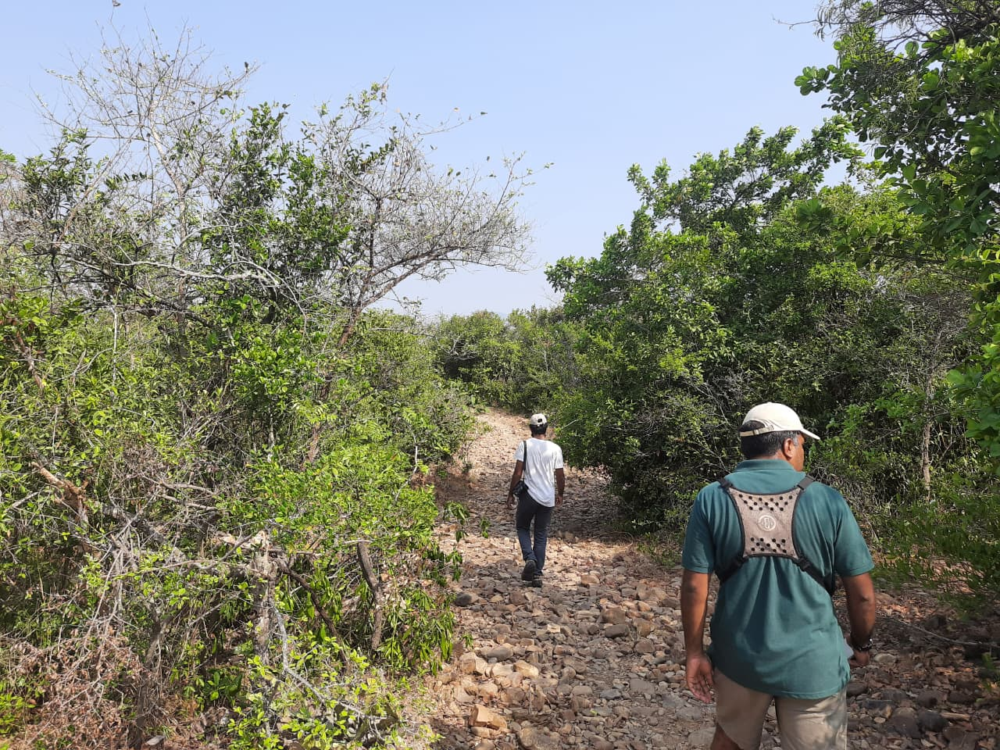{alt="Jerdon's Courser reconnaissance survey"}

::: gallery-caption
<h3>Eastern Ghats — April 2022</h3>

<p>Reconnaissance surveys with Raja Bandi and Viral Joshi, scouting sites for a long-term passive acoustic monitoring project focused on the Critically Endangered Jerdon's Courser.</p>
:::
::::
:::::::::::::::::::::::::::::::

```{=html}
<!-- ======================================================
     2021
     ====================================================== -->
```

<h2 class="media-year">

2021

</h2>

::::::::::: gallery
::::: gallery-item
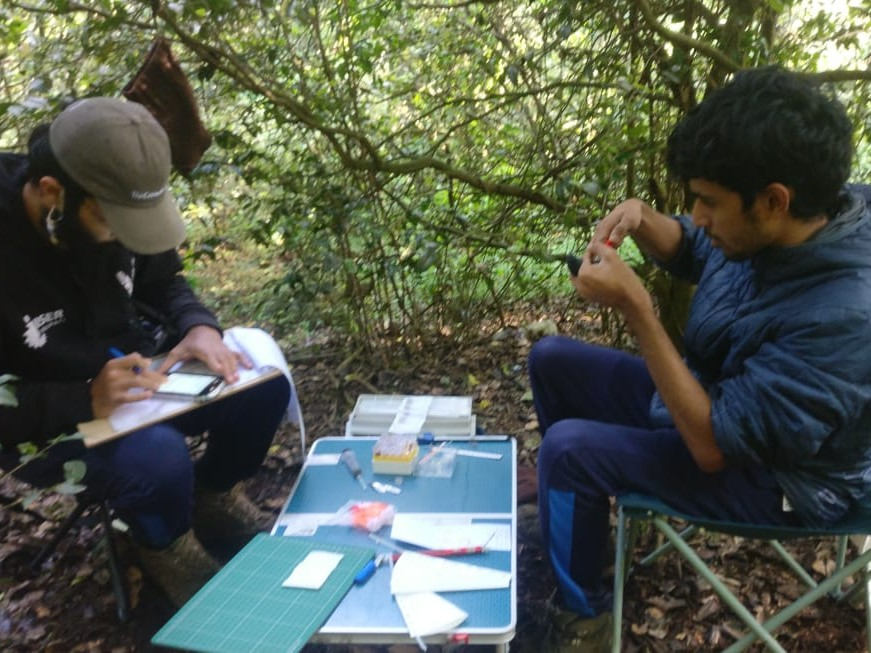{alt="Color-banding White-bellied Sholakilis"}

:::: gallery-caption
<h3>Bombay Shola — June 2021</h3>

<p>Color-banding White-bellied Sholakilis with Harikrishnan C. P. and Viral Joshi as part of our long-term study of the population.</p>

::: credit
Photo: Viral Joshi
:::
::::
:::::

::::: gallery-item
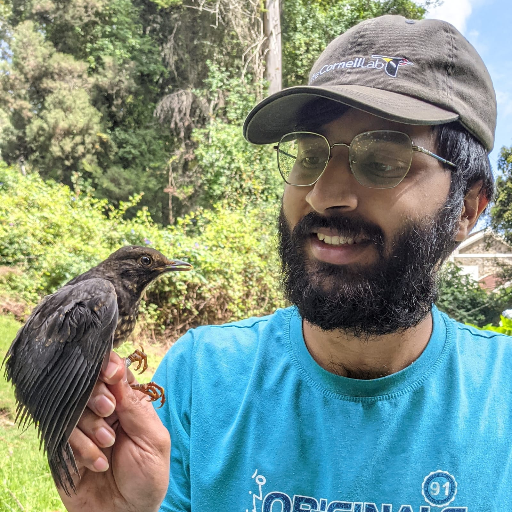{alt="Juvenile Indian Blackbird"}

:::: gallery-caption
<h3>Kodaikanal — May 2021</h3>

<p>The first bird I ever banded was a juvenile Indian Blackbird (<em>Turdus simillimus</em>) during fieldwork in the Western Ghats.</p>

::: credit
Photo: Viral Joshi
:::
::::
:::::

:::: gallery-item
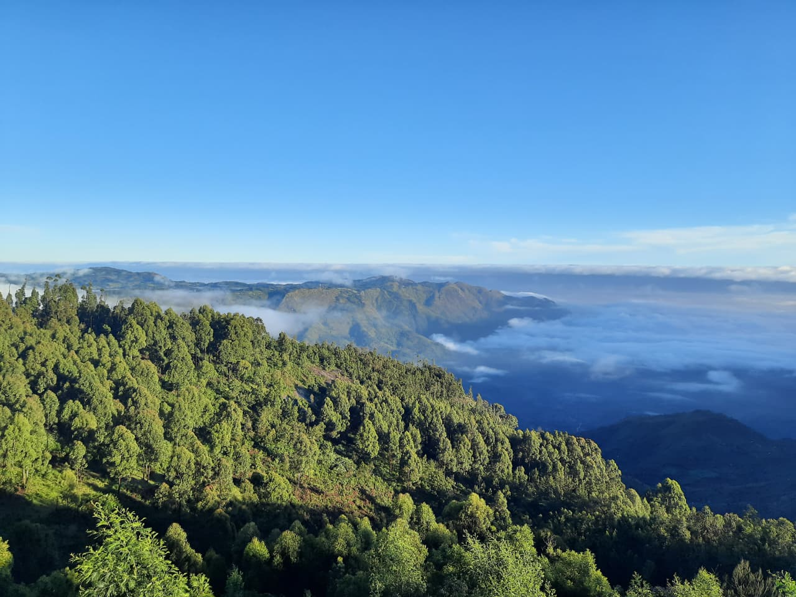{alt="Shola sky islands in the Palani Hills"}

::: gallery-caption
<h3>Palani Hills — January 2021</h3>

<p>Shola sky islands in the Palani Hills: mountaintops emerging above a blanket of clouds, with introduced <em>Pinus</em> spreading across the foreground landscape.</p>
:::
::::
:::::::::::

```{=html}
<!-- ======================================================
     2020
     ====================================================== -->
```

<h2 class="media-year">

2020

</h2>

:::::::: gallery
:::: gallery-item
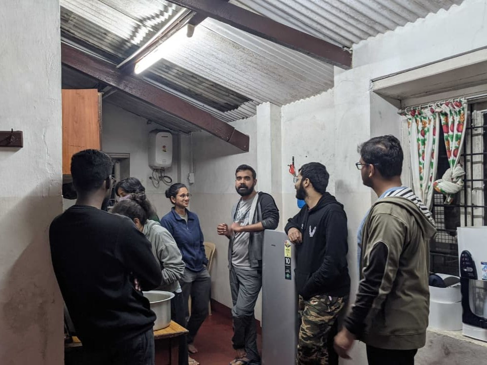{alt="Bird Lab at Kodaikanal Field Station"}

::: gallery-caption
<h3>Kodaikanal Field Station — December 2020</h3>

<p>An intense scientific discussion about <strong>what's for dinner?</strong> Kitchen talks with members of the Bird Lab at our field station in Kodaikanal.</p>
:::
::::

::::: gallery-item
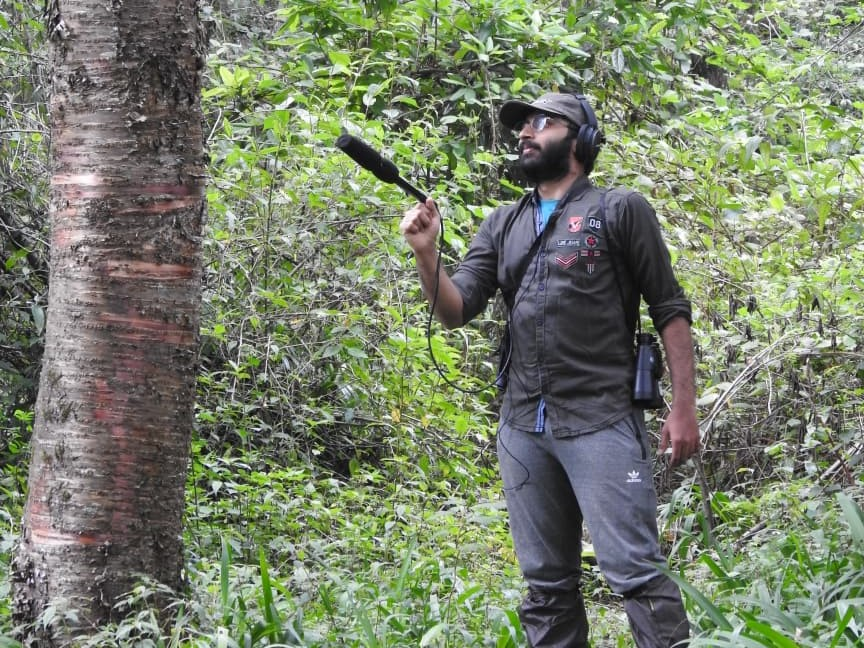{alt="Recording White-bellied Sholakilis"}

:::: gallery-caption
<h3>Kodaikanal — December 2020</h3>

<p>Back in the field after the pandemic lockdowns, recording White-bellied Sholakilis (<em>Sholicola albiventris</em>) in the shola forests around Kodaikanal, Tamil Nadu.</p>

::: credit
Photo: Viral Joshi
:::
::::
:::::
::::::::

```{=html}
<!-- ======================================================
     2019
     ====================================================== -->
```

<h2 class="media-year">

2019

</h2>

::::::::: gallery
:::: gallery-item
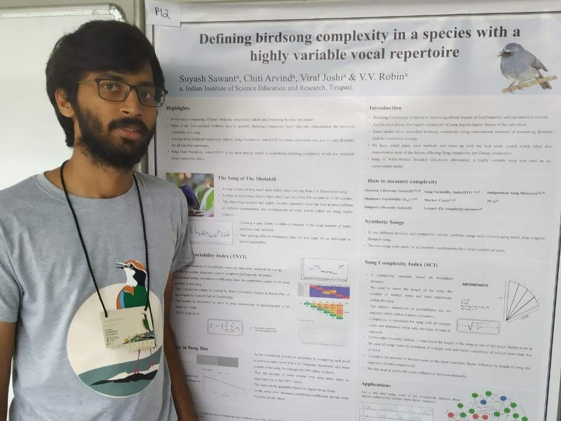{alt="NSAB 2019 poster presentation"}

::: gallery-caption
<h3>NSAB, Tirupati — December 2019</h3>

<p>My first scientific poster presentation at the National Symposium on Avian Biology: developing quantitative tools to measure bird song complexity. The poster received third prize.</p>
:::
::::

:::: gallery-item
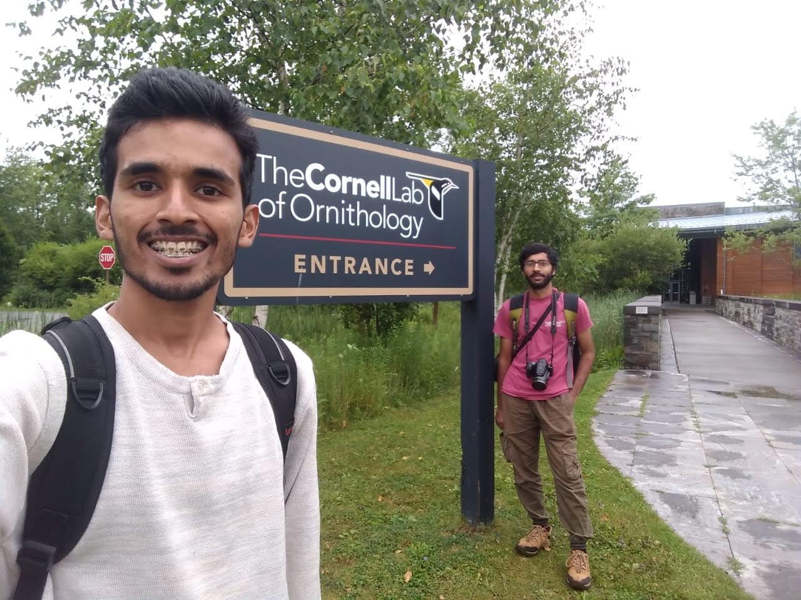{alt="Cornell Lab of Ornithology"}

::: gallery-caption
<h3>Cornell Lab of Ornithology — July 2019</h3>

<p>At the Cornell Lab of Ornithology during a six-week summer internship at the K. Lisa Yang Center for Conservation Bioacoustics, working with Harikrishnan C. P.</p>
:::
::::

:::: gallery-item
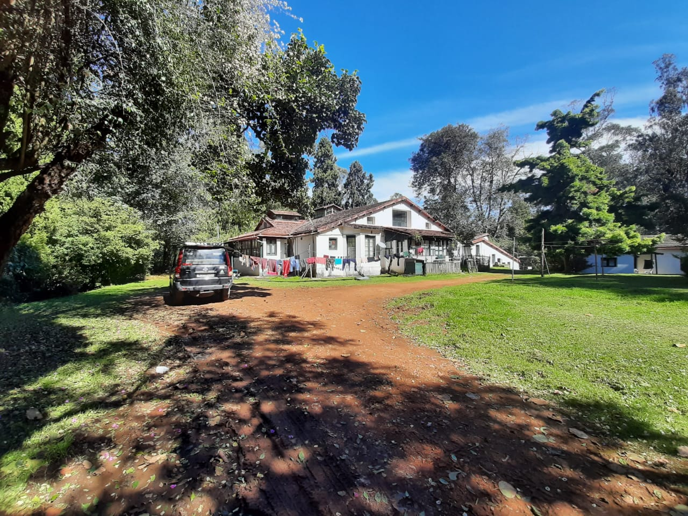{alt="Kodaikanal Ecology Field Station"}

::: gallery-caption
<h3>Kodaikanal — May 2019</h3>

<p>The Kodaikanal International School–IISER Tirupati Ecology Field Station in the Palani Hills, Tamil Nadu—the home base for much of my early fieldwork in the shola forests.</p>
:::
::::
:::::::::

```{=html}
<!-- ======================================================
     2018
     ====================================================== -->
```

<h2 class="media-year">

2018

</h2>

:::::: gallery
::::: gallery-item
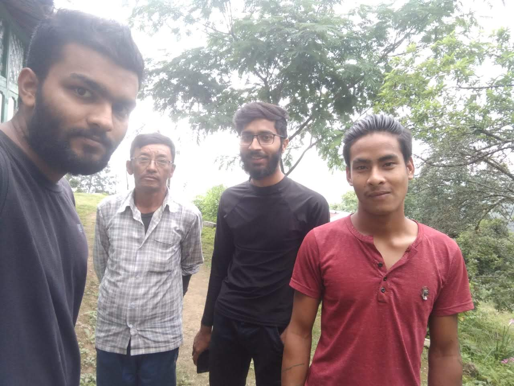{alt="Field internship at Eaglenest Wildlife Sanctuary"}

:::: gallery-caption
<h3>Arunachal Pradesh — June 2018</h3>

<p>My first field internship—and my introduction to field ecology—studying moths with Dr. Ramana Athreya in Eaglenest Wildlife Sanctuary, Arunachal Pradesh. Pictured with Sachin and local field assistants.</p>

::: credit
Photo: Sachin
:::
::::
:::::
::::::
