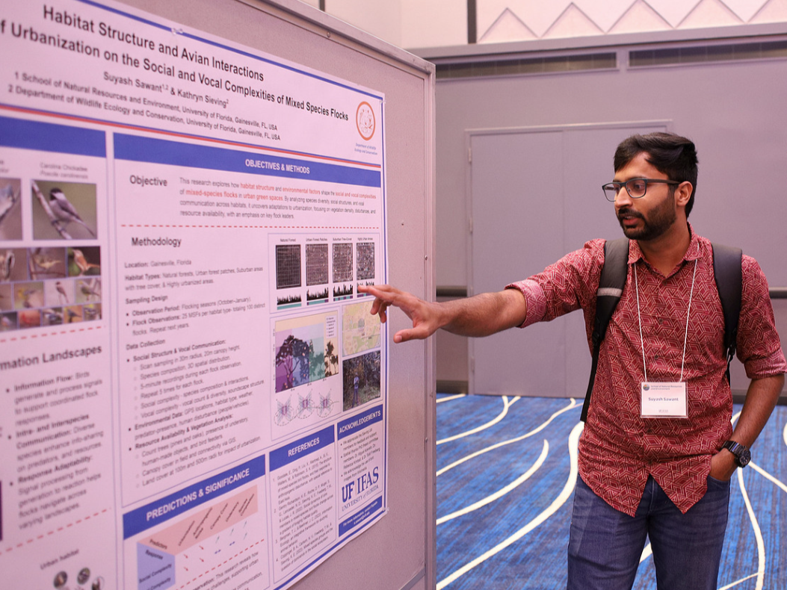
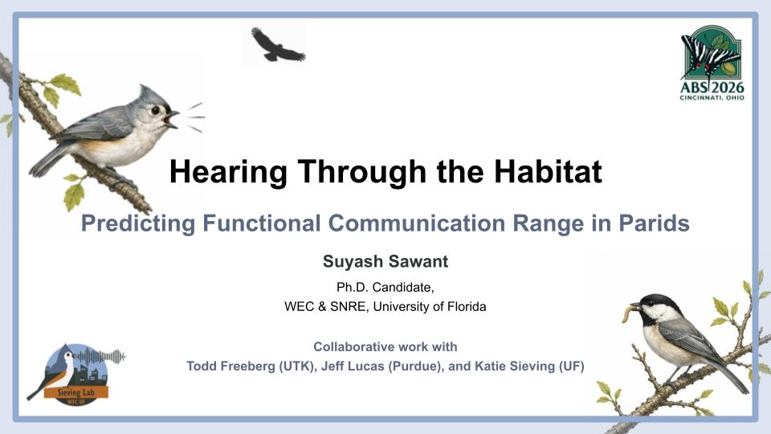
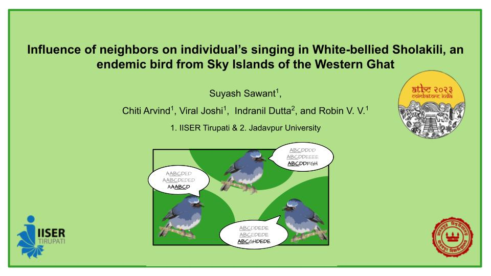
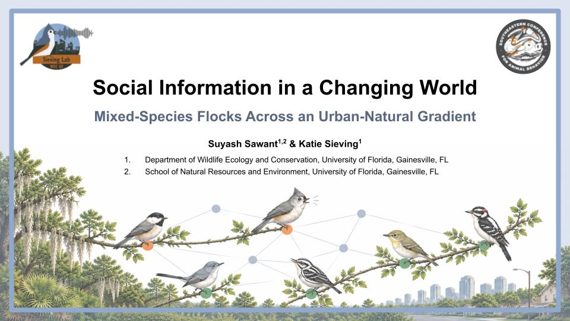
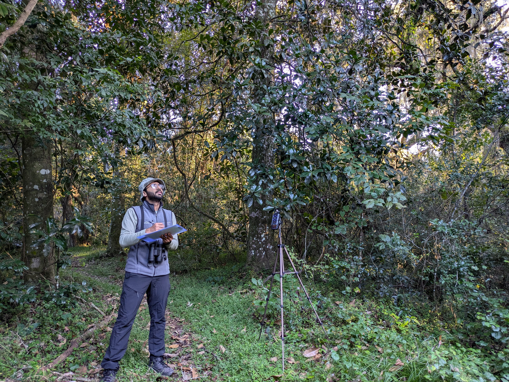
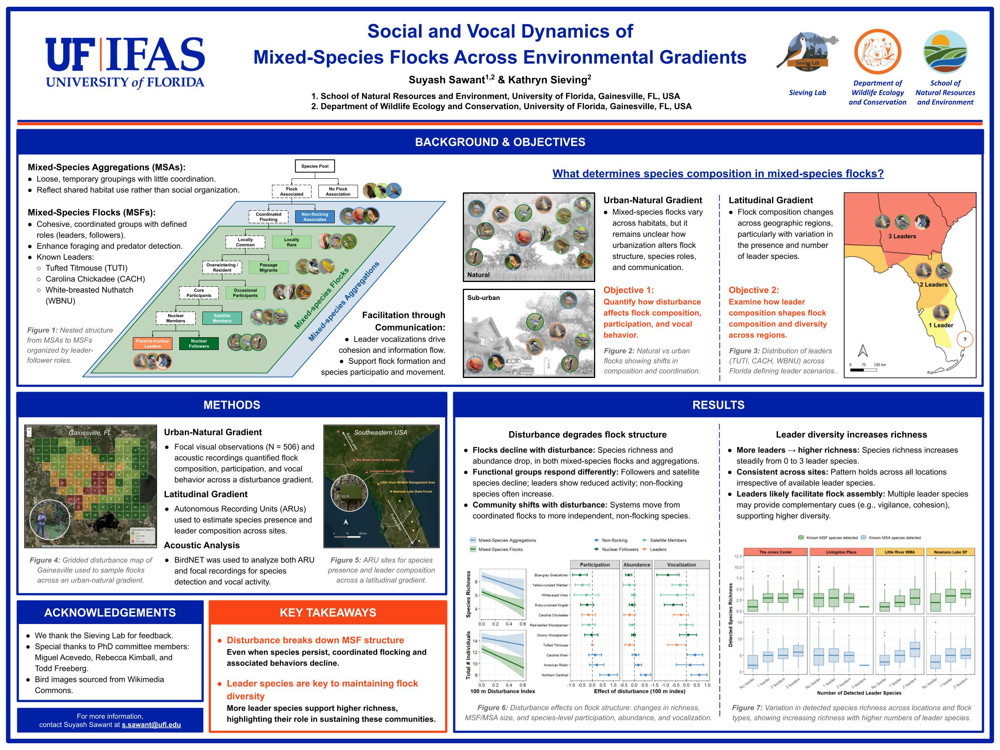

```{=html}
<style>

/* =========================================================
   PAGE BASICS
========================================================= */

#title-block-header h1,
.quarto-title h1,
.title h1 {
  text-align: center;
  margin-bottom: 1.5rem;
}

/* Full-width research area */
.research-page {
  width: 100vw;
  margin-left: calc(50% - 50vw);
  margin-right: calc(50% - 50vw);
  background: #f7f5ef;
  color: #1d1d1d;
}


/* =========================================================
   PROJECT SECTIONS
========================================================= */

.research-project {
  padding: 4.5rem 5rem;
}

.research-project:nth-child(odd) {
  background: #f7f5ef;
}

.research-project:nth-child(even) {
  background: #edf0ea;
}

.project-inner {
  max-width: 1350px;
  margin: 0 auto;

  display: grid;
  grid-template-columns: minmax(0, 1.25fr) minmax(320px, 0.75fr);
  gap: 5rem;

  align-items: center;
}


/* Alternate text / image positions */

.research-project.reverse .project-text {
  order: 2;
}

.research-project.reverse .project-image {
  order: 1;
}


/* =========================================================
   PROJECT TEXT
========================================================= */

.project-number {
  font-size: 0.82rem;
  text-transform: uppercase;
  letter-spacing: 0.13em;
  font-weight: 700;
  color: #647565;
  margin-bottom: 0.6rem;
}

.project-title {
  font-size: clamp(1.75rem, 2.5vw, 2.65rem);
  font-weight: 700;
  line-height: 1.12;
  margin: 0 0 1.6rem 0;
  color: #263328;
}

.project-text p {
  font-size: 1rem;
  line-height: 1.7;
  margin-bottom: 1.15rem;
}

.project-text em {
  color: inherit;
}


/* =========================================================
   PROJECT IMAGES
========================================================= */

.project-image {
  display: flex;
  align-items: center;
  justify-content: center;
}

.project-image img {
  width: auto;
  height: 100%;
  display: block;

  max-height: 300px;
  object-fit: contain;

  border-radius: 4px;
}


/* =========================================================
   PUBLICATIONS
========================================================= */

.project-subheading {
  margin-top: 2rem;
  margin-bottom: 0.7rem;

  font-size: 0.84rem;
  text-transform: uppercase;
  letter-spacing: 0.09em;

  color: #526453;
  font-weight: 700;
}

.publication-list {
  margin: 0;
  padding-left: 1.3rem;
}

.publication-list li {
  margin-bottom: 0.75rem;
  line-height: 1.5;
  font-size: 0.91rem;
}

.publication-list a {
  color: #526c58;
  text-decoration-thickness: 1px;
  text-underline-offset: 2px;
}


/* =========================================================
   COLLABORATORS
========================================================= */

.collaborators {
  margin-top: 1.25rem;
  font-size: 0.91rem;
  line-height: 1.55;
}

.collaborators strong {
  color: #526453;
}


/* =========================================================
   OTHER PROJECTS
========================================================= */

.other-projects {
  background: #5f705f;
  color: white;
  padding: 4.5rem 5rem 5rem 5rem;
}

.other-projects-inner {
  max-width: 1350px;
  margin: 0 auto;
}

.other-projects h2 {
  color: white;
  font-size: 2rem;
  margin-bottom: 2rem;
}

.other-project-grid {
  display: grid;
  grid-template-columns: repeat(3, minmax(0, 1fr));
  gap: 1.6rem 2rem;
}

.other-project-card {
  border-top: 1px solid rgba(255,255,255,0.4);
  padding-top: 1rem;
}

.other-project-card h3 {
  color: white;
  font-size: 1.05rem;
  line-height: 1.35;
  margin: 0;
}

.other-project-card p {
  color: #edf0e8;
  font-size: 0.82rem;
  margin: 0.45rem 0 0 0;
}


/* =========================================================
   TABLET
========================================================= */

@media (max-width: 1000px) {

  .research-project {
    padding: 3.5rem 3rem;
  }

  .project-inner {
    grid-template-columns: minmax(0, 1fr) minmax(280px, 0.8fr);
    gap: 3rem;
  }

  .other-project-grid {
    grid-template-columns: repeat(2, minmax(0, 1fr));
  }

}


/* =========================================================
   MOBILE
========================================================= */

@media (max-width: 750px) {

  .research-project {
    padding: 3rem 1.5rem;
  }

  .project-inner {
    grid-template-columns: 1fr;
    gap: 2rem;
  }

  /* Always show text before image on mobile */
  .research-project.reverse .project-text,
  .project-text {
    order: 1;
  }

  .research-project.reverse .project-image,
  .project-image {
    order: 2;
  }

  .project-title {
    font-size: 1.7rem;
  }

  .project-text p {
    font-size: 0.96rem;
  }

  .other-projects {
    padding: 3rem 1.5rem;
  }

  .other-project-grid {
    grid-template-columns: 1fr;
  }

}

</style>


<div class="research-page">


<!-- =========================================================
     PROJECT 1
========================================================= -->

<section class="research-project">

  <div class="project-inner">

    <div class="project-text">

      <div class="project-number">Project 01</div>

      <h2 class="project-title">
        Avian Vocal Complexity: Structural and Functional Dimensions
      </h2>

      <p>
        Avian vocal complexity has been a long-term interest of mine, beginning
        with efforts to develop quantitative approaches to describe and compare
        the complexity of birdsong. Over time, this has expanded into a broader
        interest in both the structural and functional dimensions of vocal
        complexity: how complex a vocal signal is, what that complexity means
        for communication, and how it may arise from the different information
        that signals encode and convey.
      </p>

      <p>
        My earlier work focused on developing and refining two quantitative
        measures of structural song complexity: the Song Richness Index (SRI)
        and Note Variability Index (NVI). I am currently expanding this work by
        synthesizing the past five decades of research on avian vocal
        complexity. We are examining how “vocal complexity” has been
        conceptualized and quantified across the literature and identifying
        important gaps and future directions.
      </p>

      <div class="project-subheading">
        Publications & Manuscripts
      </div>

      <ol class="publication-list">

        <li>
          <strong>Sawant, S.</strong>; Kimball, R.; Freeberg, T.; & Sieving, K.
          (In prep.).
          <em>Five Decades of Avian Vocal Complexity: Integrating Structural
          and Functional Dimensions.</em>
        </li>

        <li>
          <strong>Sawant, S.</strong>; Arvind, C.; Joshi, V.; & Robin, V. V.
          (2022).
          <em>Spectrogram cross-correlation can be used to measure the
          complexity of bird vocalizations.</em>
          <strong>Methods in Ecology and Evolution.</strong>
          <a href="https://doi.org/10.1111/2041-210X.13765" target="_blank">
            DOI
          </a>
        </li>

        <li>
          <strong>Sawant, S.</strong>; Arvind, C.; Joshi, V.; & Robin, V. V.
          (2021).
          <em>Song Richness Index: A measure to understand the diversity and
          repetition of notes in a birdsong.</em>
          <strong>bioRxiv.</strong>
          <a href="https://doi.org/10.1101/2021.12.18.472638" target="_blank">
            DOI
          </a>
        </li>

      </ol>

      <div class="collaborators">
        <strong>Collaborators:</strong>
        Chiti Arvind, Katie Sieving, Rebecca Kimball, Robin V. V.,
        Todd Freeberg
      </div>

    </div>


    <div class="project-image">
      
    </div>

  </div>

</section>


<!-- =========================================================
     PROJECT 2
========================================================= -->

<section class="research-project reverse">

  <div class="project-inner">

    <div class="project-text">

      <div class="project-number">Project 02</div>

      <h2 class="project-title">
        Mechanistic Models of Sound Transmission and Functional Communication Ranges
      </h2>

      <p>
        Animal communication depends on both the production of a signal and
        what happens to that signal as it travels through the environment.
        I am interested in understanding how far vocal information can
        functionally travel in natural environments and what determines that
        distance. Rather than treating communication range as a fixed property
        of a species or vocalization, I approach it as the outcome of
        interactions among signal amplitude and frequency, transmission
        distance, vegetation structure, atmospheric conditions, background
        noise, and the perceptual abilities of receivers.
      </p>

      <p>
        My current work uses controlled playback experiments and mechanistic
        models of sound transmission to quantify these processes in the
        vocalizations of Tufted Titmice and Carolina Chickadees. By separating
        different sources of signal attenuation and degradation, we are
        developing a framework that links sound production at the source to
        the acoustic characteristics of signals after propagation through
        natural environments. The longer-term goal is to integrate these
        predictions with receiver perception to estimate functional
        communication ranges across vocalizations, species, habitats, and
        environmental conditions.
      </p>

      <div class="project-subheading">
        Publications & Manuscripts
      </div>

      <ol class="publication-list">

        <li>
          <strong>Sawant, S.</strong>; Lucas, J.; Freeberg, T.; & Sieving, K.
          (In prep.).
          <em>From Signal Production to Propagation: A Mechanistic Framework
          for Modeling Vocal Signal Transmission.</em>
        </li>

      </ol>

      <div class="collaborators">
        <strong>Collaborators:</strong>
        Jeff Lucas, Katie Sieving, Todd Freeberg
      </div>

    </div>


    <div class="project-image">
      
    </div>

  </div>

</section>


<!-- =========================================================
     PROJECT 3
========================================================= -->

<section class="research-project">

  <div class="project-inner">

    <div class="project-text">

      <div class="project-number">Project 03</div>

      <h2 class="project-title">
        Cultural Evolution of Vocal Signals:
        Complex Songs of the White-bellied Sholakili
      </h2>

      <p>
        Many bird vocalizations are learned rather than entirely innate,
        allowing vocal traditions to be shared, maintained, and modified
        through social interactions and across generations. I am interested in
        how these processes shape complex vocal repertoires across multiple
        spatial and temporal scales: how song elements are shared among
        individuals within populations, how vocal traditions diverge among
        populations, how individual repertoires change through time, and how
        song elements are transmitted both horizontally among individuals and
        vertically across generations. The White-bellied Sholakili
        (<em>Sholicola albiventris</em>), an endemic songbird of the montane
        forests of the Western Ghats, provides a particularly interesting
        system for exploring these questions because of its highly complex and
        individually variable songs.
      </p>

      <p>
        Using multi-year recordings from individually identified birds and
        populations across their geographic range, we are examining vocal
        variation at multiple levels of organization, from individual note
        types to longer sequences of notes. Our work explores the rules
        governing song sharing among individuals, the persistence and turnover
        of vocal elements through time, and the emergence of population-level
        vocal traditions and dialects.
      </p>

      <div class="project-subheading">
        Publications & Manuscripts
      </div>

      <ol class="publication-list">

        <li>
          Nair, S.; Arvind, C.; <strong>Sawant, S.</strong>; Natesh, M.;
          & Robin, V. V.
          (In prep.).
          <em>Do closely related birds also share songs? A case study of the
          White-bellied Sholakili <span style="font-style: italic;">
          Sholicola albiventris</span>.</em>
        </li>

        <li>
          Arvind, C.; <strong>Sawant, S.</strong>; Srinivasan, R.;
          Arpitha, G. P.; Goyal, N.; Warudkar, A.; & Robin, V. V.
          (bioRxiv, 2025).
          <em>Songs show strong individual-level variation and weak
          population-level dialects in a tropical songbird with genetic
          structure.</em>
          Under review at
          <strong>Proceedings of the National Academy of Sciences.</strong>
        </li>

        <li>
          <strong>Sawant, S.</strong>; Arvind, C.; Joshi, V.; Dutta, I.;
          & Robin, V. V.
          (bioRxiv, 2025).
          <em>Linguistic Rules of Syntax and Sharing in the Complex Songs
          of a Tropical Passerine.</em>
          Under review at
          <strong>The American Naturalist.</strong>
        </li>

      </ol>

      <div class="collaborators">
        <strong>Collaborators:</strong>
        Chiti Arvind, Indranil Dutta, Robin V. V., Sethulakshmi Nair,
        Viral Joshi
      </div>

    </div>


    <div class="project-image">
      
    </div>

  </div>

</section>


<!-- =========================================================
     PROJECT 4
========================================================= -->

<section class="research-project reverse">

  <div class="project-inner">

    <div class="project-text">

      <div class="project-number">Project 04</div>

      <h2 class="project-title">
        Anthropogenic Disturbance and the Social Dynamics of Mixed-Species Flocks
      </h2>

      <p>
        Animals rarely respond to environmental change as isolated individuals.
        Changes to habitats can also alter the social interactions through
        which animals find resources, avoid predators, and acquire information.
        I study this process using mixed-species bird flocks, dynamic social
        communities in which multiple species travel and forage together while
        exchanging information. These flocks provide an opportunity to ask how
        anthropogenic disturbance reshapes which species occur in a community,
        who interacts with whom, and how those interactions change through
        time.
      </p>

      <p>
        My current work follows mixed-species flocks across natural, suburban,
        and urban landscapes in north-central Florida. Through repeated field
        observations, dynamic occupancy models, and social network analyses,
        we are examining how flock membership, persistence, species
        associations, and network structure respond to habitat characteristics
        and anthropogenic disturbances at multiple spatial scales. This work
        aims to move beyond conventional measures of species richness and
        abundance to understand how environmental change can reorganize the
        social structure of these dynamic communities.
      </p>

      <div class="collaborators">
        <strong>Collaborators:</strong>
        Katie Sieving, Miguel Acevedo, Todd Freeberg
      </div>

    </div>


    <div class="project-image">
      
    </div>

  </div>

</section>


<!-- =========================================================
     PROJECT 5
========================================================= -->

<section class="research-project">

  <div class="project-inner">

    <div class="project-text">

      <div class="project-number">Project 05</div>

      <h2 class="project-title">
        Vocal Communication ↔ Social Dynamics:
        Parids as Informers and Facilitators in Mixed-Species Flocks
      </h2>

      <p>
        Communication and social structure can influence one another in both
        directions. Social relationships determine who has access to whose
        information, while vocal communication can help create and maintain
        those relationships. I am particularly interested in this feedback
        within mixed-species bird flocks, where species like Tufted Titmice,
        Carolina Chickadees, and White-breasted Nuthatches can act as important
        sources of social information. Their vocalizations may facilitate flock
        formation and cohesion while providing other species with information
        about predators, resources, and the behavior of nearby individuals.
      </p>

      <p>
        This project examines how the roles of these informers and facilitators
        change across species, social contexts, and environmental conditions.
        We are combining field observations, passive acoustic monitoring, and
        measurements of vocal behavior to connect patterns of vocal
        communication with flock participation and social associations. A major
        goal is to understand whether changes in social structure alter how
        information is produced and exchanged and, conversely, whether changes
        in communication help explain the formation, persistence, and breakdown
        of mixed-species associations.
      </p>

      <div class="collaborators">
        <strong>Collaborators:</strong>
        Katie Sieving, Todd Freeberg
      </div>

    </div>


    <div class="project-image">
      
    </div>

  </div>

</section>


<!-- =========================================================
     PROJECT 6
========================================================= -->

<section class="research-project reverse">

  <div class="project-inner">

    <div class="project-text">

      <div class="project-number">Project 06</div>

      <h2 class="project-title">
        Passive Acoustic Monitoring of Mixed-Species Flocks
        Across a Latitudinal Gradient
      </h2>

      <p>
        The identity and diversity of species that facilitate mixed-species
        flocks change dramatically across the southeastern United States.
        Moving from north to south, these communities transition from systems
        with three major flock leaders and information providers, to two, to
        one, and eventually to a system without any traditional leaders. This
        natural geographic transition provides an opportunity to ask what
        happens to a social system as the species that organize and facilitate
        information exchange are progressively lost.
      </p>

      <p>
        We are building a passive acoustic monitoring network across this
        latitudinal gradient, using autonomous recording units to track
        flock-associated species and their vocal activity across space and
        time. Initial sampling spans sites from southwestern Georgia through
        Florida, with ongoing expansion farther south to capture the complete
        transition in flock leadership. By comparing species co-occurrence and
        vocal activity across this gradient, we aim to understand how the
        organization and information dynamics of mixed-species flocks change
        as the diversity of their traditional leaders declines.
      </p>

      <div class="collaborators">
        <strong>Collaborators:</strong>
        David Mason, Kate Richardson, Katie Sieving, Todd Freeberg
      </div>

    </div>


    <div class="project-image">
      
    </div>

  </div>

</section>


<!-- =========================================================
     OTHER PROJECTS
========================================================= -->

<section class="other-projects">

  <div class="other-projects-inner">

    <h2>Other Projects</h2>

    <div class="other-project-grid">

      <div class="other-project-card">
        <h3>
          Function-Specific Vocal Libraries:
          Time × Frequency × Amplitude
        </h3>
        <p>Ongoing</p>
      </div>

      <div class="other-project-card">
        <h3>
          Modeling Dynamic Interactions in Mixed-Species Flocks
        </h3>
        <p>Ongoing</p>
      </div>

      <div class="other-project-card">
        <h3>
          Bird Feeders and the Structure of Mixed-Species Flocks
        </h3>
        <p>Ongoing</p>
      </div>

      <div class="other-project-card">
        <h3>
          Evolution of Vocal Complexity in Old World Flycatchers
          (Muscicapidae)
        </h3>
      </div>

      <div class="other-project-card">
        <h3>
          Acoustic Identification of Understudied Species in the
          Western Ghats, India
        </h3>
      </div>

      <div class="other-project-card">
        <h3>
          Sexual Size Dimorphism in Southern Flying Squirrels
        </h3>
      </div>

    </div>

  </div>

</section>

```
</div>