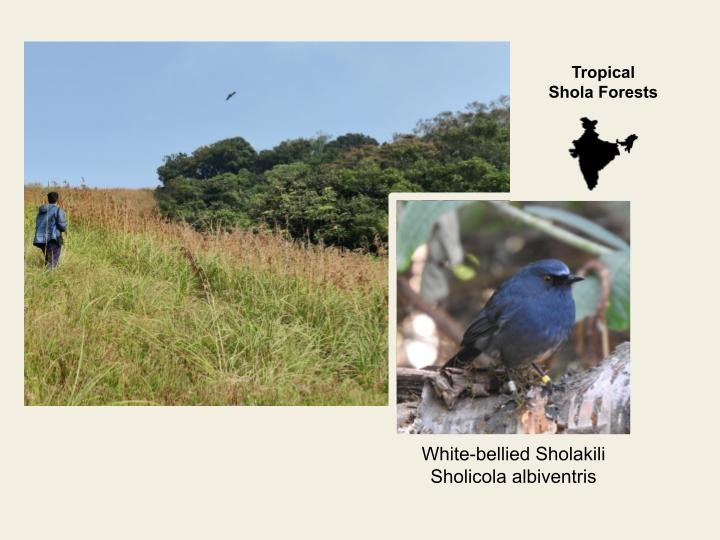
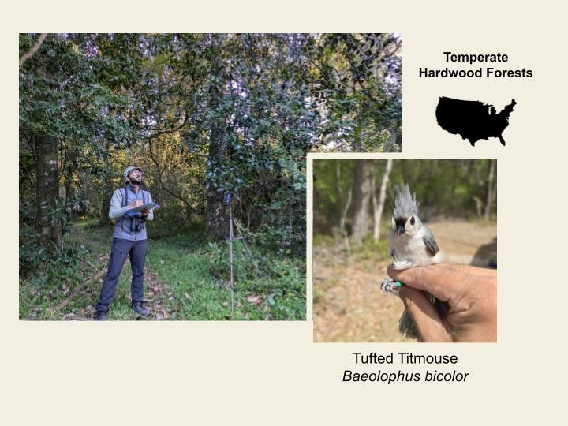
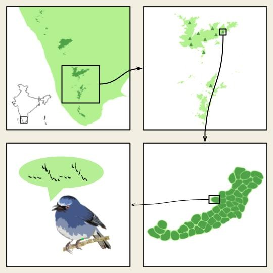
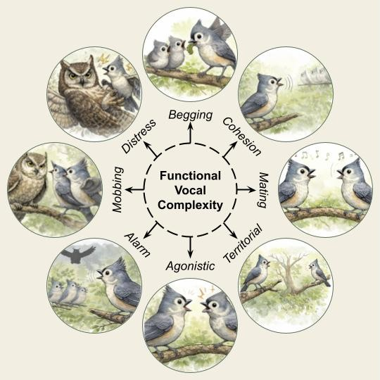
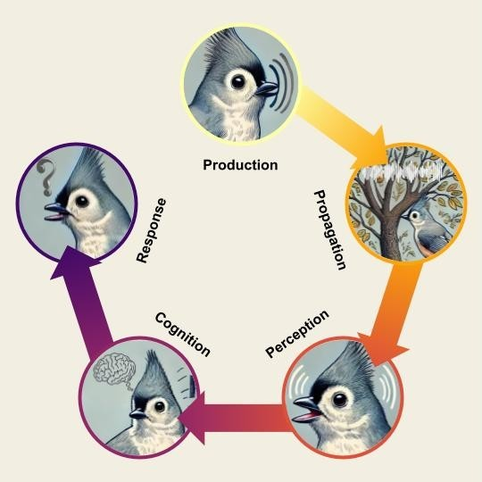
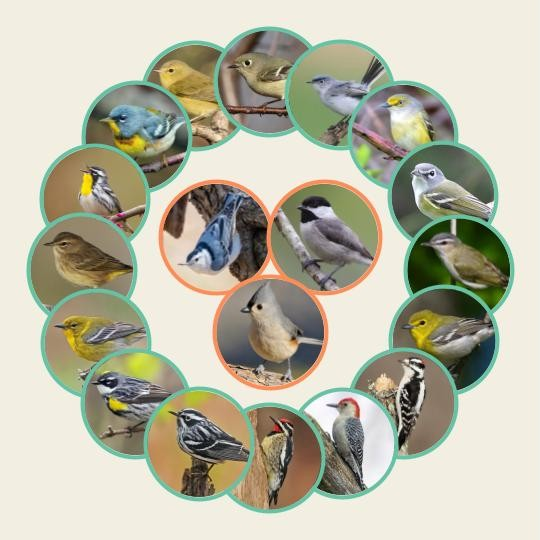

```{=html}
<style>
#title-block-header h1,
.quarto-title h1,
.title h1 {
  text-align: center;
}

/* Full-width sections */
.research-hero,
.research-page {
  width: 100vw;
  margin-left: calc(50% - 50vw);
  margin-right: calc(50% - 50vw);
}

/* Top species/systems panel */
.research-hero {
  background-color: #f4efe4;
  color: #111;
  padding: 2rem 4rem 3rem 4rem;
}

.hero-systems {
  display: grid;
  grid-template-columns: repeat(2, minmax(360px, 620px));
  gap: 4rem;
  justify-content: center;
  align-items: center;
  max-width: 1400px;
  margin: 0 auto;
}

.system-card {
  min-height: auto;
}

.system-composite-img {
  width: 100%;
  height: auto;
  display: block;
}

/* Research themes panel */
.research-page {
  background-color: #5f705f;
  color: white;
  padding: 2.5rem 0 3rem 0;
}

.research-themes {
  display: grid;
  grid-template-columns: repeat(6, 1fr);
  gap: 1.8rem;
  max-width: 1500px;
  margin: 0 auto;
  padding: 0 3.5rem;
}

.theme-card {
  text-align: center;
}

.theme-card img {
  width: 100%;
  aspect-ratio: 1 / 1;
  object-fit: cover;
  border: 2px solid #111;
  background-color: #f4efe4;
}

.theme-card h3 {
  font-size: 1rem;
  margin: 0.8rem 0 0.4rem 0;
  color: white;
  line-height: 1.1;

  text-align: center;
}

.theme-card p {
  font-size: 0.78rem;
  color: #f4efe4;
  line-height: 1.2;
  margin: 0;
}

.theme-link {
  text-decoration: none;
  color: inherit;
  display: block;
}

.theme-link:hover .theme-card {
  transform: translateY(-5px);
  transition: 0.2s ease;
}

.theme-link:hover img {
  filter: brightness(1.05);
}

.theme-card {
  text-align: center;
  transition: transform 0.2s ease;
}

.theme-link:hover .theme-card {
  transform: translateY(-5px);
}

@media (max-width: 1100px) {
  .hero-systems {
    grid-template-columns: 1fr;
    max-width: 650px;
    gap: 2rem;
  }

  .research-themes {
    grid-template-columns: repeat(3, 1fr);
  }
}

@media (max-width: 650px) {
  .research-hero {
    padding: 1.5rem;
  }

  .research-themes {
    grid-template-columns: repeat(2, 1fr);
    padding: 0 1.5rem;
  }
}
</style>
```

```{=html}
<div class="research-hero">
  <div class="hero-systems">

    <div class="system-card">
      
    </div>

    <div class="system-card">
      
    </div>

  </div>
</div>

<div class="research-page">
  <div class="research-themes">

    <a href="natural-history.html" class="theme-link">
      <div class="theme-card">
        
        <h3>Natural History</h3>
        <p>What behaviors and interactions shape communication in the wild?</p>
      </div>
    </a>

    <a href="evolution-birdsong.html" class="theme-link">
      <div class="theme-card">
        
        <h3>Evolution of Birdsong</h3>
        <p>How do birdsongs vary across species, populations, and environmental gradients?</p>
      </div>
    </a>

    <a href="structural-vocal-complexity.html" class="theme-link">
      <div class="theme-card">
        
        <h3>Structural Vocal Complexity</h3>
        <p>What makes avian vocalizations structurally complex?</p>
      </div>
    </a>

    <a href="functional-vocal-complexity.html" class="theme-link">
      <div class="theme-card">
        
        <h3>Functional Vocal Complexity</h3>
        <p>How do different signals convey information across contexts?</p>
      </div>
    </a>

    <a href="avian-information-landscapes.html" class="theme-link">
      <div class="theme-card">
        
        <h3>Avian Information<br>Landscapes</h3>
        <p>How does information flow within avian communities?</p>
      </div>
    </a>

    <a href="mixed-species-flocks-social-interactions.html" class="theme-link">
      <div class="theme-card">
        
        <h3>Mixed-species Flocks<br>Social Interactions</h3>
        <p>What drives the organization and stability of bird flocks?</p>
      </div>
    </a>

  </div>
</div>
```
