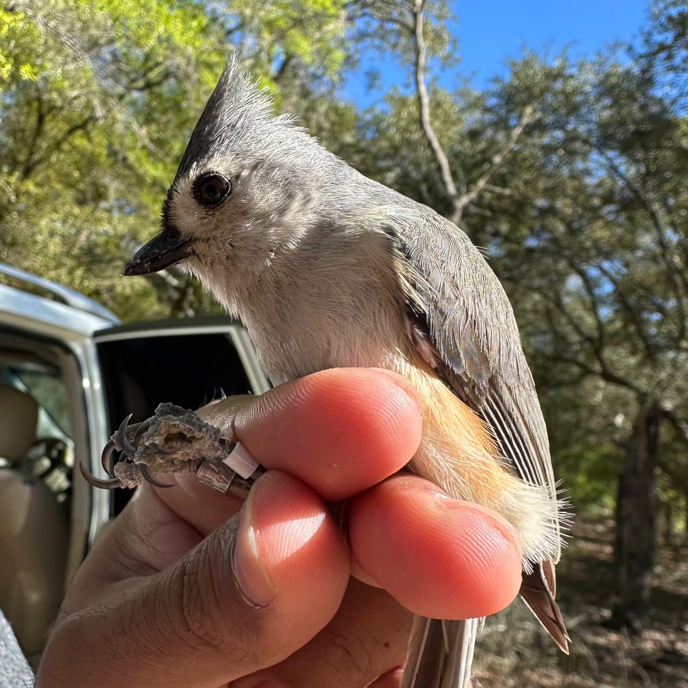
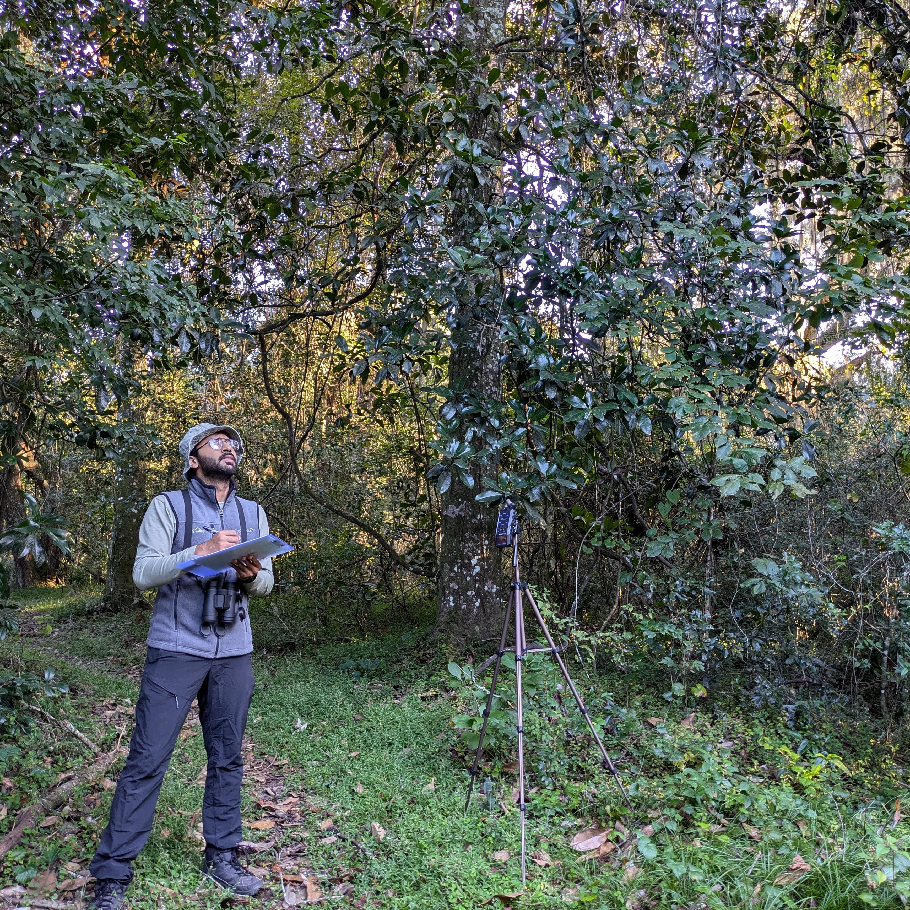

<!-- ======================  PAGE-LEVEL CSS  ====================== -->

```{=html}
<style>
.feature-row {
  display: grid;
  grid-template-columns: 1fr 1fr;  /* two equal-width columns */
  column-gap: 2rem;               /* spacing between columns */
  margin-bottom: 3rem;
  align-items: start;
}

/* normal layout: text left, image right */
.feature-text-left {
  grid-column: 1;
}
.feature-img-right {
  grid-column: 2;
}

/* reversed layout: image left, text right */
.feature-img-left {
  grid-column: 1;
}
.feature-text-right {
  grid-column: 2;
}

.feature-img img {
  max-width: 100%;
  height: auto;
  border-radius: 8px;
}
</style>
```

------------------------------------------------------------------------

<!-- ======================  BLOCK 1: AVIAN VOCAL COMPLEXITY  ====================== -->

::::: feature-row
::: feature-text
## Avian Vocal Complexity

### What is Vocal Complexity in Birds?

Coming soon...

### Quantifying Vocal Complexity

Coming soon...

### Bird Songs vs. Human Linguistics

Coming soon...
:::

::: feature-img

:::
:::::

------------------------------------------------------------------------

<!-- ======================  BLOCK 2: MIXED-SPECIES FLOCK DYNAMICS (IMAGE LEFT)  ====================== -->

::::: {.feature-row .reverse}
::: feature-text
## Mixed-Species Flocks

### Species Roles and Interspecific Interactions

Coming soon...

### Vocal Communication and Social Dynamics

Coming soon...

### Flocks Across Gradients

Coming soon...
:::

::: feature-img
{width="1600"}
:::
:::::

------------------------------------------------------------------------

<!-- ======================  BLOCK 3: CULTURAL EVOLUTION OF BIRDSONGS  ====================== -->

::::: feature-row
::: feature-text
## Songs of Sholakili

### Song Complexity and Repertoire Size

Coming soon...

### Song Consistency and Sharing

Coming soon...

### Cultural and Genetic Variation

Coming soon...
:::

::: feature-img
{width="1600"}
:::
:::::
